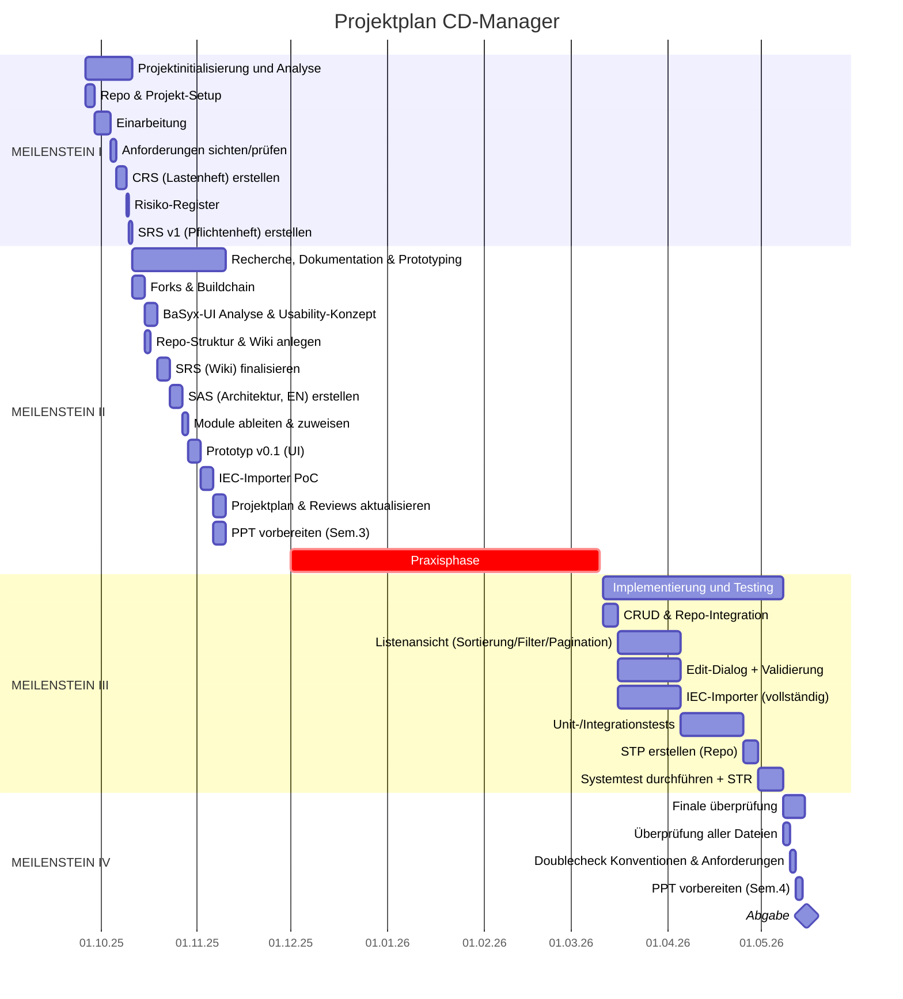

| Task                                         | Beschreibung                                                            | Start    | Ende     | Tage     |
|----------------------------------------------|-------------------------------------------------------------------------|----------|----------|----------|
| **MEILENSTEIN I**                            | Projektinitialisierung und Analyse                                      | 26.09.25 | 11.10.25 | **_15_** |
| Repo & Projekt-Setup                         | Repo nach Schema anlegen; Issue-Tracker & README vorbereiten            | 26.09.25 | 29.09.25 | 3        |
| Einarbeitung                                 | AASX-Explorer & BaSyx lokal aufsetzen; Tutorials & Grundlagen verstehen | 29.09.25 | 04.10.25 | 5        |
| Anforderungen sichten/prüfen                 | Anforderungen analysieren und validieren                                | 04.10.25 | 06.10.25 | 2        |
| CRS (Lastenheft) erstellen                   | Funktionale & nicht-funktionale Anforderungen dokumentieren             | 06.10.25 | 09.10.25 | 3        |
| Risiko-Register                              | Risiken identifizieren und Gegenmaßnahmen definieren                    | 09.10.25 | 10.10.25 | 1        |
| SRS v1 (Pflichtenheft) erstellen             | Erste Version des Pflichtenhefts erstellen                              | 10.10.25 | 11.10.25 | 1        |
|                                              |                                                                         |          |          |          |
| **MEILENSTEIN II**                           | Recherche, Dokumentation & Prototyping                                  | 11.10.25 | 10.11.25 | **_30_** |
| Forks & Buildchain                           | BaSyx-Repositories forken und Buildchain aufsetzen                      | 11.10.25 | 15.10.25 | 4        |
| BaSyx-UI Analyse & Usability-Konzept         | Bestehende UI analysieren und UX-Konzept definieren                     | 15.10.25 | 19.10.25 | 4        |
| Repo-Struktur & Wiki anlegen                 | Projektstruktur und Dokumentations-Wiki anlegen                         | 15.10.25 | 17.10.25 | 2        |
| SRS (Wiki) finalisieren                      | Pflichtenheft im Wiki vervollständigen                                  | 19.10.25 | 23.10.25 | 4        |
| SAS (Architektur, EN) erstellen              | Softwarearchitektur und Schnittstellen definieren                       | 23.10.25 | 27.10.25 | 4        |
| Module ableiten & zuweisen                   | Komponenten identifizieren und Verantwortlichkeiten vergeben            | 27.10.25 | 29.10.25 | 2        |
| Prototyp v0.1 (UI)                           | Erste UI-Version mit Dummy-Daten erstellen                              | 29.10.25 | 02.11.25 | 4        |
| IEC-Importer PoC                             | Proof-of-Concept für IEC-Importer implementieren                        | 02.11.25 | 06.11.25 | 4        |
| Projektplan & Reviews aktualisieren          | Reviews und Projektplanung aktualisieren                                | 06.11.25 | 10.11.25 | 4        |
| PPT vorbereiten (Sem.3)                      | Präsentation für Semester 3 vorbereiten                                 | 06.11.25 | 10.11.25 | 4        |
|                                              |                                                                         |          |          |          |
| Praxisphase                                  | Praxisphase / Unterbrechung                                             | 01.12.25 | 10.03.26 | **_99_** |
|                                              |                                                                         |          |          |          |
| **MEILENSTEIN III**                          | Implementierung und Testing                                             | 11.03.26 | 08.05.26 | **_58_** |
| CRUD & Repo-Integration                      | CRUD-Funktionalität und Repository-Anbindung implementieren             | 11.03.26 | 16.03.26 | 5        |
| Listenansicht (Sortierung/Filter/Pagination) | Tabellenansicht mit Sortierung, Filterung und Pagination entwickeln     | 16.03.26 | 05.04.26 | 20       |
| Edit-Dialog + Validierung                    | Dialoge und Validierungslogik implementieren                            | 16.03.26 | 05.04.26 | 20       |
| IEC-Importer (vollständig)                   | Vollständigen IEC-Importer inkl. Persistenz implementieren              | 16.03.26 | 05.04.26 | 20       |
| Unit-/Integrationstests                      | Modul- und Integrationstests durchführen                                | 05.04.26 | 25.04.26 | 20       |
| STP erstellen (Repo)                         | Systemtestplan dokumentieren                                            | 25.04.26 | 30.04.26 | 5        |
| Systemtest durchführen + STR                 | Systemtests ausführen und Ergebnisse dokumentieren                      | 30.04.26 | 08.05.26 | 8        |
|                                              |                                                                         |          |          |          |
| **MEILENSTEIN IV**                           | Finale Überprüfung                                                      | 08.05.26 | 15.05.26 | **_7_**  |
| Überprüfung aller Dateien                    | Vollständigkeitsprüfung aller Projektdokumente                          | 08.05.26 | 10.05.26 | 2        |
| Doublecheck Konventionen & Anforderungen     | Anforderungen und Konventionen final prüfen                             | 10.05.26 | 12.05.26 | 2        |
| PPT vorbereiten (Sem.4)                      | Abschlusspräsentation vorbereiten                                       | 12.05.26 | 14.05.26 | 2        |
| Abgabe                                       | Finale Projektabgabe                                                    | 15.05.26 | 16.05.26 | 1        |

