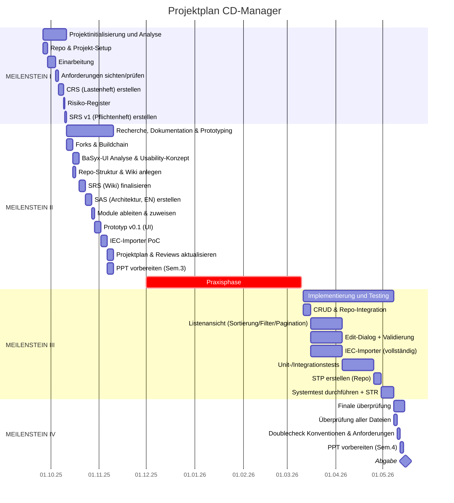

# Business Case (BC) - BaSyx ConceptDescription-Plugin(CD-Manager)

| Auftraggeber:    | M. Rentschler & P. Wójcik & A. Zielstorff |
|------------------|-------------------------------------------|
| Firmenstandort:  | Lerchenweg 1, 70178                       |
| Hersteller Name: | Team 1                                    |

| Rolle                 | Name der Beteiligten |
|-----------------------|----------------------|
| Projektleiter         | Anna                 |
| Projektmanager        | Niklas               |
| Testmanager           | Priyanshu            | 
| Systemarchitekt       | Chris                | 
| Technischer Redalteur | Lütfi                |

## Versionskontrolle

| **Version** | **Datum**  | **Autor** | **Anmerkung**                                                            |
|-------------|------------|-----------|--------------------------------------------------------------------------|
| 1.0         | 14.11.2025 | Anna      | Erste Version                                                            |
| 2.0         | 21.11.2025 | Anna      | entfernung diverser Rechtschreibfehler und kleine, inhaltliche Ergänzung |
| 3.0         | 08.05.2026 | Anna      | Überarbeitung des Business Case                                          |

## Inhaltsverzeichnis

<!-- TOC -->
* [Business Case (BC) - BaSyx ConceptDescription-Plugin(CD-Manager)](#business-case-bc---basyx-conceptdescription-plugincd-manager)
  * [Versionskontrolle](#versionskontrolle)
  * [Inhaltsverzeichnis](#inhaltsverzeichnis)
  * [Wichtige Dokumente](#wichtige-dokumente)
  * [Übersicht](#übersicht)
    * [Projektbeschreibung](#projektbeschreibung)
    * [Ausgangssituation](#ausgangssituation)
    * [Ziele](#ziele)
    * [Nutzen](#nutzen)
      * [Fachlicher Nutzen](#fachlicher-nutzen)
      * [Wirtschaftlicher Nutzen](#wirtschaftlicher-nutzen)
  * [Kostenrechnung](#kostenrechnung)
    * [Vorgehensweise / Methode](#vorgehensweise--methode)
    * [Fixkosten](#fixkosten)
    * [Variable Kosten](#variable-kosten)
    * [Gesamtkosten](#gesamtkosten)
  * [Risikoanalyse](#risikoanalyse)
    * [Identifizierte Risiken](#identifizierte-risiken)
    * [Bewertung](#bewertung)
      * [Risiken](#risiken)
      * [Risikominimierung](#risikominimierung)
  * [Projektplanung](#projektplanung)
    * [GANTT-Diagramm](#gantt-diagramm)
<!-- TOC -->

## Wichtige Dokumente

- [Customer Requirement Specification: CRS](../CRS/TINF24F_1-CRS-6v0.md)
- [Software Requirement Specification: SRS](../SRS/TINF24F_1-SRS-2v0.md)
- [Software Architecture Specification: SAS](../SAS/TINF24F_1-SAS-3v0.md)
- [System Test Plan: STP](../STP/TINF24F_1-STP-0v3.md)

## Übersicht

### Projektbeschreibung

Im Rahmen dieses Projekts soll die Verwaltung von Concept Descriptions (CDs) innerhalb der BaSyx Web UI erweitert und
benutzerfreundlicher gestaltet werden.
Dazu wird eine neue Vue-Komponente (CD-Manager) entwickelt, welche die bisherige Component Visualization Ansicht
ersetzt.

Die neue Oberfläche soll eine zentrale Verwaltung aller im CD Repository verfügbaren CDs ermöglichen.
Anwender sollen bestehende Einträge übersichtlich anzeigen, durchsuchen, bearbeiten und löschen können.
Zusätzlich soll es möglich werden, CDs direkt über die Benutzeroberfläche zu importieren.

Zur Verbesserung der Bedienbarkeit wird die Darstellung der CDs an bestehende UI-Konzepte angepasst.
Die Ansicht erhält eine feste Breite analog zur bestehenden AASList-Komponente und integriert eine Suchfunktion zur
schnellen Filterung vorhandener Einträge.

Darüber hinaus sollen Nutzer der Web UI in der Lage sein, CDs in Submodellen zu de-/referenzieren.
Hierbei wird im Hintergrund automatisch die entsprechende SemanticId gesetzt, welche die ausgewählte CD referenziert.

Ziel des Projekts ist die Implementierung einer zentralen und intuitiven Verwaltungsoberfläche zur effizienten Pflege
und Nutzung von CDs über die Web UI.

### Ausgangssituation

In der Eclipse-BaSyx Web UI können Asset Administration Shells (AAS) verwaltet werden, welche nach dem Standard aus
Submodulen (SM), CDs und der Shell selbst besteht.
Aktuell lassen sich nur Shell und SMs über die Web UI Verwalten, die CDs jedoch nur über die REST API des existierenden
CD Repositories.
Nutzer brauchen in der Web UI eine Möglichkeit zur grafischen Interaktion mit den CDs um diese sinnvoll verwalten zu
können
Ohne eine Grafische Verwaltungsoberfläche sind Nutzer nicht fähig CDs zu verwenden und wissen zudem nicht über den
aktuellen Bestand der CDs bescheid.
Selbst Technisch versierte Nutzer werden langfristig nicht in der Lage sein, eine große Menge an CDs manuell über die
REST API zu verwalten.

### Ziele

- Nutzer sollen die Möglichkeit haben, die bereits existierenden CDs über die Web UI zu finden und inspizieren.
- Nutzer der Web UI sollen in der Lage sein CDs zu importieren, editieren, de-/referenzieren und löschen.

### Nutzen

#### Fachlicher Nutzen

Der CD-Manager verbessert die Transparenz und Verwaltung von CDs innerhalb der Web UI erheblich.
CDs werden zentral sichtbar dargestellt und können dadurch einfacher gepflegt, wiederverwendet und verwaltet werden.

Durch die Integration einer Such- und Verwaltungsfunktion wird die Auffindbarkeit bestehender Concept Descriptions
verbessert.
Dies reduziert den manuellen Aufwand bei der Pflege semantischer Informationen und vereinfacht die Arbeit mit
bestehenden Datenbeständen.

Zusätzlich ermöglicht die zentrale Verwaltung eine konsistente Verwendung von Concept Descriptions innerhalb von
Submodellen.
Änderungen und Anpassungen können effizienter durchgeführt werden, ohne dass bestehende AAS über Umwege angepasst werden
müssen.

Die Benutzerfreundlichkeit der Web UI wird durch die direkte Verwaltungsmöglichkeit erheblich verbessert, wodurch
Arbeitsabläufe vereinfacht und administrative Tätigkeiten reduziert werden.

#### Wirtschaftlicher Nutzen

Durch die zentrale Verwaltung von CDs innerhalb der Web UI wird der Arbeitsaufwand bei der Pflege semantischer
Informationen reduziert.
Mehrere manuelle Arbeitsschritte können vereinfacht oder automatisiert werden, wodurch Änderungen effizienter
durchgeführt werden können.

Die verbesserte Auffindbarkeit und Wiederverwendbarkeit bestehender Concept Descriptions reduziert Aufwände in der
Datenpflege und Neuerstellung bereits vorhandener Inhalte.

Zusätzlich werden Fehlerquellen bei der manuellen Pflege von SemanticIds reduziert.
Dies verringert den Aufwand für Fehlerbehebung und Nacharbeiten und verbessert langfristig die Wartbarkeit der
Datenstrukturen.

Durch die optimierten Arbeitsabläufe können administrative Tätigkeiten schneller durchgeführt werden.
Die gewonnene Zeit kann hierbei in weiter Aufgaben fließen, was die Produktivität jedes Nutzers steigert.

---

## Kostenrechnung

### Vorgehensweise / Methode

Verwendete Methoden:

- Vollkostenrechnung
- Teilkostenrechnung
- Weitere Verfahren:
    - <!-- Risikoanalyse -->
    - <!-- Break-Even-Analyse -->
    - <!-- Wirtschaftlichkeitsrechnung -->

---

### Fixkosten

| Kostenart           | Beschreibung               | Betrag | Anzahl | Kosten für das gesamte Team |
|---------------------|----------------------------|--------|--------|-----------------------------|
| Hardware            | Entwickler Laptops         | 0 €    | 5      | 0 €                         |
| Software / Lizenzen | ECLASS Lizenz              | 700 €  | 1      | 700 €                       |
| Infrastruktur       | Cloud server               | 200 €  | 1      | 200 €                       |
| Schulungen          | -                          | -      | -      | -                           |
| Energie & Internet  | Kosten für die Entwicklung | 250 €  | 5      | 1.250 €                     |
| Sonstige Kosten     | -                          | -      | -      | -                           |
| **Gesamt**          |                            |        |        | **2.150 €**                 |

---

### Variable Kosten

| Rolle                          | Teammitglied | Stundensatz | Eingeplante Arbeitsstunden | Kosten für 170 Stunden |
|--------------------------------|--------------|-------------|----------------------------|------------------------|
| Projektleiter                  | Anna         | 45 €        | 180                        | 8.150 €                |
| Projektmanager                 | Niklas       | 30 €        | 180                        | 5.400 €                |
| Testmanager                    | Priyanshu    | 25 €        | 180                        | 4.500 €                |
| Systemarchitekt                | Chris        | 25 €        | 180                        | 4.500 €                |
| Technischer Redalteur          | Lütfi        | 30 €        | 180                        | 5.400 €                |
| **Geschätzte variable Kosten** |              |             |                            | **27.950 €**           |

---

### Gesamtkosten

| Kostenkategorie  | Betrag       |
|------------------|--------------|
| Fixkosten        | 2.150 €      |
| Variable Kosten  | 27.950 €     |
| Risikopuffer     | 6.000 €      |
| **Gesamtkosten** | **36.100 €** |

---

## Risikoanalyse

### Identifizierte Risiken

| Risiko              | Wahrscheinlichkeit | Auswirkung | Gegenmaßnahme |
|---------------------|--------------------|------------|---------------|
| Technische Risiken  |                    |            |               |
| Terminrisiken       |                    |            |               |
| Ressourcenrisiken   |                    |            |               |
| Finanzielle Risiken |                    |            |               |

---

### Bewertung

#### Risiken

| Eintrittswahrscheinlichkeit → / Einfluss ↓ | VERY LOW                | LOW                                            | MIDDLE                       | HIGH                                | VERY HIGH           |
|------------------------------------------------|-------------------------|------------------------------------------------|------------------------------|-------------------------------------|---------------------|
| VERY LOW                                       |                         |                                                |                              |                                     |                     |
| LOW                                            |                         |                                                | Merge Konflikte              | Technische Komplexität/Ungewissheit | Prioritätskonflikte |
| MIDDLE                                         | Verzögerte Code reviews | Fehlende Dokumentation \| Lückenhaftes Testing |                              | Kompetenzlücken im Team             |                     |
| HIGH                                           |                         | Anforderungsänderungen                         | Schlechte Team Kommunikation |                                     |                     |
| VERY HIGH                                      |                         | Kranke Team Mitglieder                         | Zeit knappheit               |                                     |                     |

#### Risikominimierung

Wöchentliche meetings im Team behandelt:

- Schlechte Team Kommunikation

Code Dokumentation und Erstellung geteilter Dokumente (z.B. CRS, SRS, SAS, STP, MOD) behandelt:

- Fehlende Dokumentation
- Lückenhaftes Testing
- Kranke Team Mitglieder
- Technische Komplexität/Ungewissheit

Funktionale Trennung der Software komponenten behandelt:

- Merge Konflikte
- Anforderungsänderungen
- Technische Komplexität/Ungewissheit

Recherche und Prototyping behandelt:

- Technische Komplexität/Ungewissheit
- Kompetenzlücken im Team

---

## Projektplanung

### GANTT-Diagramm

