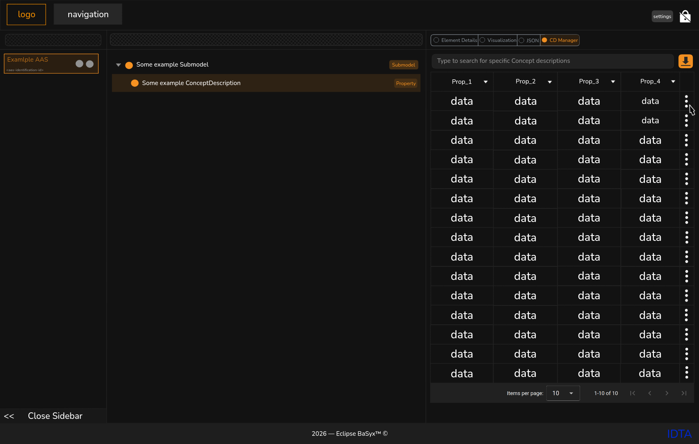
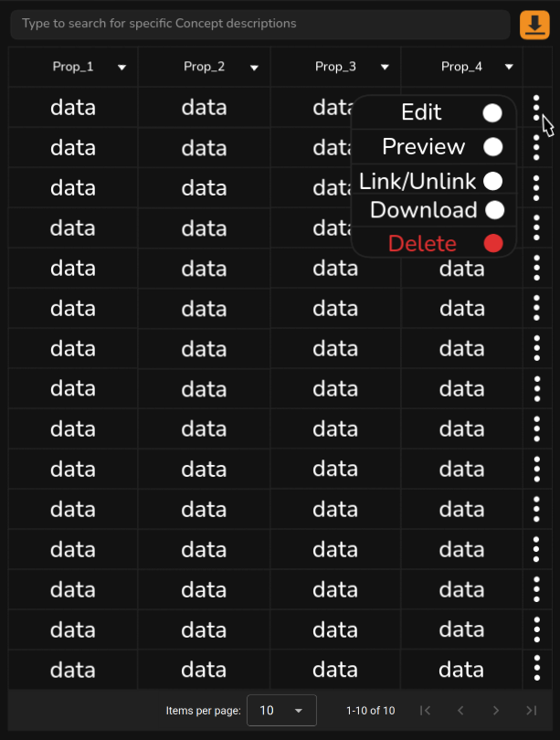
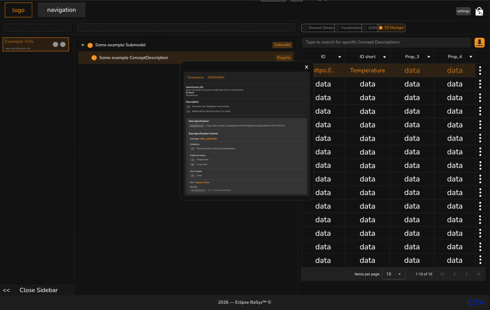
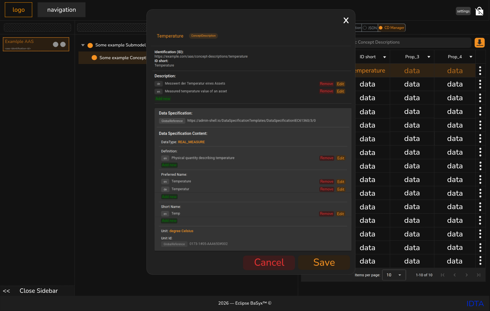
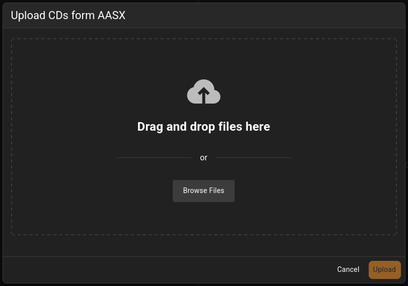
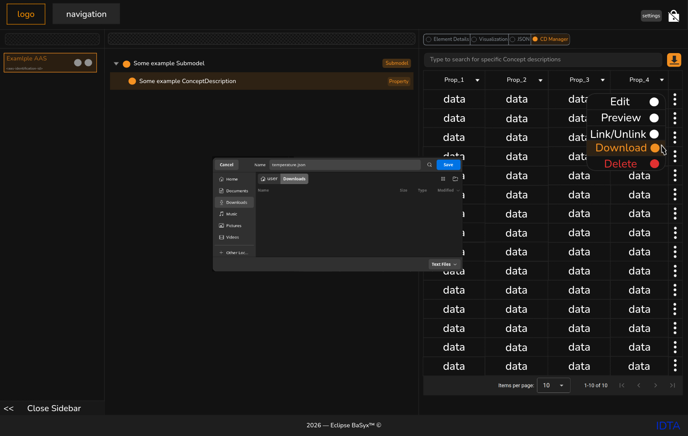
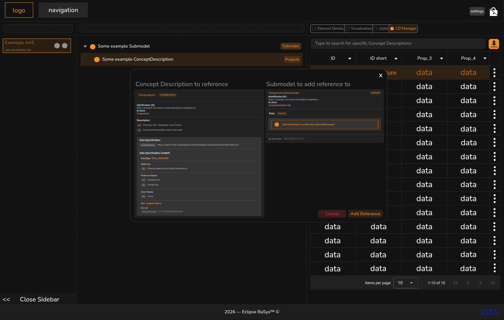
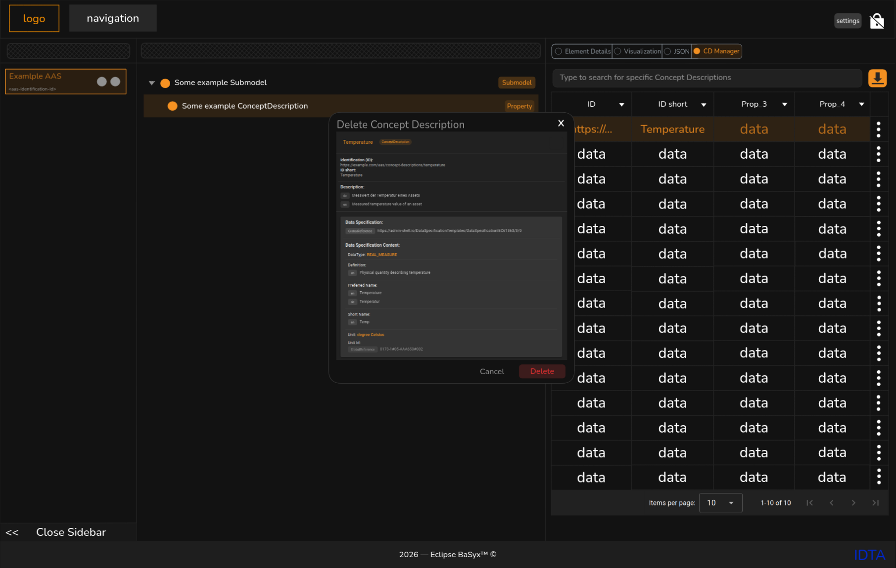
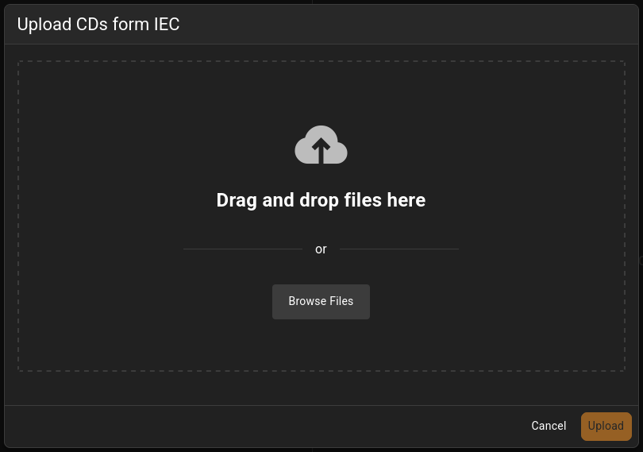

# Customer Requirement Specification (CRS) - BaSyx ConceptDescription-Plugin (CD-Manager)

## Versionskontrolle

| **Version** | **Datum**  | **Autor** | **Anmerkung**                                                   |
|-------------|------------|-----------|-----------------------------------------------------------------|
| 1.0         | 11.10.2025 | Anna      | Erste Version                                                   |
| 2.0         | 25.10.2025 | Anna      | Überarbeitung des Inhalts und   Korrektur von Schreibfehlern |
| 3.0         | 02.11.2025 | Anna      | Gezielte Anpassung an die Formatanforderungen                   |
| 4.0         | 14.11.2025 | Anna      | Denglisch -> deutsch & Abgleich mit SRS                         |
| 5.0         | 18.11.2025 | Anna      | Nicht funktionale Anforderungen überarbeitet                    | 
| 6.0         | 09.05.2026 | Anna      | Überarbeitung des ganzen Dokuments                              |

## Inhaltsverzeichnis

<!-- TOC -->
* [Customer Requirement Specification (CRS) - BaSyx ConceptDescription-Plugin (CD-Manager)](#customer-requirement-specification-crs---basyx-conceptdescription-plugin-cd-manager)
  * [Versionskontrolle](#versionskontrolle)
  * [Inhaltsverzeichnis](#inhaltsverzeichnis)
  * [Begriffe und Abkürzungen](#begriffe-und-abkürzungen)
  * [Zweck des Dokuments](#zweck-des-dokuments)
  * [Umfang und beschreibung des Softwareprodukts](#umfang-und-beschreibung-des-softwareprodukts)
  * [Nutzeranforderungen](#nutzeranforderungen)
    * [UC-1: CDs in Tabelle und Tabellenseiten auflisten und suchen/filtern](#uc-1-cds-in-tabelle-und-tabellenseiten-auflisten-und-suchenfiltern)
      * [Beschreibung](#beschreibung)
      * [Designvorstellung](#designvorstellung)
    * [UC-2: Tabellen-interaktionen auf einzelnen CDs](#uc-2-tabellen-interaktionen-auf-einzelnen-cds)
      * [Beschreibung](#beschreibung-1)
      * [Designvorstellung](#designvorstellung-1)
    * [UC-3: Detail-Ansicht für CDs](#uc-3-detail-ansicht-für-cds)
      * [Beschreibung](#beschreibung-2)
      * [Designvorstellung](#designvorstellung-2)
    * [UC-4: Editor-Ansicht für CDs](#uc-4-editor-ansicht-für-cds)
      * [Beschreibung](#beschreibung-3)
      * [Designvorstellung](#designvorstellung-3)
    * [UC-5: Import Funktion für CD über AASX](#uc-5-import-funktion-für-cd-über-aasx)
      * [Beschreibung](#beschreibung-4)
      * [Designvorstellung](#designvorstellung-4)
    * [UC-6: Import Funktion für IECs als CD](#uc-6-import-funktion-für-iecs-als-cd)
      * [Beschreibung](#beschreibung-5)
      * [Designvorstellung](#designvorstellung-5)
    * [UC-7: Export Funktion für CDs](#uc-7-export-funktion-für-cds)
      * [Beschreibung](#beschreibung-6)
      * [Designvorstellung](#designvorstellung-6)
    * [UC-8: Referenzierung von CDs in Submodellen](#uc-8-referenzierung-von-cds-in-submodellen)
      * [Beschreibung](#beschreibung-7)
      * [Designvorstellung](#designvorstellung-7)
    * [UC-9: Löschen einzelner CDs aus dem CD repository](#uc-9-löschen-einzelner-cds-aus-dem-cd-repository)
      * [Beschreibung](#beschreibung-8)
      * [Designvorstellung](#designvorstellung-8)
    * [UC-10: CDs über JSON Datei importieren](#uc-10-cds-über-json-datei-importieren)
      * [Beschreibung](#beschreibung-9)
      * [Designvorstellung](#designvorstellung-9)
  * [Funktionale Anforderungen (MoSCoW)](#funktionale-anforderungen-moscow)
    * [Muss (M)](#muss-m)
    * [Soll (S)](#soll-s)
    * [Kann (K)](#kann-k)
  * [Nicht funktionale Anforderungen (NFA)](#nicht-funktionale-anforderungen-nfa)
  * [Akzeptanzkriterien](#akzeptanzkriterien)
<!-- TOC -->

## Begriffe und Abkürzungen

| Begriff/Abkürzung         | Beschreibung                                      |
|---------------------------|---------------------------------------------------|
| BaSyx                     | Eclipse-Projekt für AAS-Referenzimplementierungen |
| AASX                      | Asset Administration Shell Dateiformat            |
| CD                        | Concept Description                               |
| CRUD                      | Create, Read, Update, Delete                      |
| DataSpecificationIEC61360 | Template/ Schemadefinition für CDs                |
| CDD                       | Common Data Dictionary                            |
| IEC                       | International Electrotechnical Commission         |
| IRDI                      | International Registration Data Identifier        |
| tbd.                      | to be determined                                  |

## Zweck des Dokuments

Dokument legt den **Zweck, Umfang und die Anforderungen** für ein BaSyx-GUI-Plugin „CD-Manager" fest - also ein
webbasiertes Tool zur zentralen Pflege von Concept Descriptions inklusive. IEC-CDD-Import. Es definiert, **warum** das
Plugin gebaut wird und **was** es genau leisten muss, sodass Entwicklung, Test und Abnahme eine klare gemeinsame
Referenz haben.

## Umfang und beschreibung des Softwareprodukts

Der abgesteckte Umfang umfasst ein webbasiertes BaSyx-GUI-Plugin („CD-Manager") zur Verwaltung von Concept Descriptions
nach DataSpecificationIEC61360 mit komfortabler Listenansicht (Suche, Sortierung, Filter) und einem
Detail-/Editor-Dialog inklusive Feld-Validierungen sowie vollständigem CRUD gegen das BaSyx-CD-Repository (REST). Hinzu
kommt ein IEC-CDD-Importer: Per URL wird die CDD-Seite geladen, relevante Inhalte werden geparst, auf 61360-Felder
gemappt und als CD neu angelegt bzw. anhand eines eindeutigen Identifiers (z. B. IRDI) dedupliziert/aktualisiert; Fehler
werden verständlich behandelt und Aktionen geloggt, ein Export ausgewählter CDs als BaSyx-kompatibles JSON ist
vorgesehen. Das Ganze läuft in der lokalen BaSyx-Dev-Umgebung und prüft vor dem Speichern Pflichtfelder, Datentypen,
zulässige Werte sowie Identifier- und Versionskonventionen.

Erweiterungen sind konfigurierbare Tabellenspalten (nutzerbezogen gespeichert), Internationalisierung der UI (de/en) und
rollenbasierter Zugriff; als optionale Features sind Massenimport mit Ergebnisübersicht, Tagging/Klassifikation und eine
Vergleichsansicht zwischen zwei CDs vorgesehen. Nicht-funktional definiert der Umfang Ziele zu Performance (z. B.
Einzelimport < 5 s; Batch 50 URLs < 5 min), Sicherheit (Auth/Rollen, Eingabevalidierung, SSRF-Schutz), Wartbarkeit (
modulare Architektur, Logging, Feature-Flags) und Portabilität (Docker, CI-Build via GitHub Actions) sowie
i18n/Locale-Support. Für die Abnahme müssen UI-Elemente und Funktionen sichtbar wirksam sein, der Importer korrekt
befüllen/aktualisieren (inkl. identifier, preferredName/definition de/en, dataType, unit, version/revision), und es sind
README/Benutzerhandbuch sowie ein Community-Beitrag (PR/MR) gefordert.

## Nutzeranforderungen

Vorbemerkung: Die Begriffe "kann", "soll" und "muss" sowie deren Varianten dienen ausschließlich der Beschreibung der
Anforderungen und lassen keinen Rückschluss auf die tatsächliche Notwendigkeit des jeweiligen Use Cases zu.

### UC-1: CDs in Tabelle und Tabellenseiten auflisten und suchen/filtern

#### Beschreibung

CDs sollen in einer neuen Tabellenansicht dargestellt werden.  
Die Tabelle soll über eine Seitenaufteilung (Pagination) verfügen.  
Zusätzlich sollen Nutzer die Möglichkeit haben, gezielt nach bestimmten CDs zu suchen und die Ergebnisse zu filtern.

#### Designvorstellung

---

### UC-2: Tabellen-interaktionen auf einzelnen CDs

#### Beschreibung

Findet ein Nutzer eine CD über die Tabellen-Ansicht,
soll durch ein drei Punkte Menü die Interaktion mit einer gewählten CD möglich sein.
Das Interaktionsmenü soll dem Nutzer erlauben mit dem CD auf folgende weise zu interagieren:

- in Detail-Ansicht öffnen
- in Editor-Ansicht öffnen
- im submodell de-/referenzieren (je nachdem ob eine Referenz schon existiert)
- als JSON exportieren
- CD löschen

#### Designvorstellung

---

### UC-3: Detail-Ansicht für CDs

#### Beschreibung

Ein Nutzer muss die Möglichkeit haben, eine CD detailliert einzusehen.
Dadurch soll die eindeutige Identifikation der richtigen CD erleichtert werden, insbesondere bei CDs mit ähnlicher
Bedeutung oder Bezeichnung.

#### Designvorstellung

---

### UC-4: Editor-Ansicht für CDs

#### Beschreibung

Ein Nutzer muss die Möglichkeit haben, eine CD über die Editor-Ansicht zu öffnen und zu bearbeiten.
Dabei soll sichergestellt werden, dass eine CD nicht in einen ungültigen Zustand versetzt oder gespeichert werden kann.

#### Designvorstellung

---

### UC-5: Import Funktion für CD über AASX

#### Beschreibung

Ein Nutzer soll in der Lage sein eine eigene AASX Datei hochzuladen und nur die CDs zu extrahieren.

#### Designvorstellung

---

### UC-6: Import Funktion für IECs als CD

#### Beschreibung

IEC-Datensätze aus dem Common Data Dictionary stellen eine zusätzliche Quelle semantischer Informationen dar.
Ein Nutzer soll die Möglichkeit haben, IEC-Datensätze hochzuladen und als CD zu importieren.

#### Designvorstellung

---

### UC-7: Export Funktion für CDs

#### Beschreibung

Ein Nutzer soll die Möglichkeit haben, CDs als JSON Datei zu exportieren.

#### Designvorstellung

**ACHTUNG:** Das Design ist für den Standard download Dialog auf Ubuntu, dieser wird auf anderen Betriebssystemen
entsprechend anders aussehen.

### UC-8: Referenzierung von CDs in Submodellen

#### Beschreibung

Ein Nutzer soll die Möglichkeit haben, CDs in einem Submodell zu referenzieren uns bestehende Referenzen zu entfernen.

#### Designvorstellung

---

### UC-9: Löschen einzelner CDs aus dem CD repository

#### Beschreibung

Ein Nutzer soll die Möglichkeit haben, CDs aus dem CD repository zu löschen.
Sollte die CD noch in Submodellen referenziert wird, soll eine Sicherung eingebaut werden, sodass die CD nicht gelöscht werden kann, solange die Referenzen bestehen.
Zudem soll der Nutzer eine Warnung erhalten, damit klar ersichtlich ist, warum die CD nicht gelöscht werden kann.

#### Designvorstellung

---

### UC-10: CDs über JSON Datei importieren

#### Beschreibung

Ein Nutzer soll die Möglichkeit haben, exportierte CDs nochmals zu importieren.
Hierbei ist zu beachten, dass das exportierte CD in einem validen Format vorliegen muss.

#### Designvorstellung

---

## Funktionale Anforderungen (MoSCoW)

### Muss (M)

- Tabellenansicht mit Sortierung, Textsuche und Pagination
- Detail/ Editor Dialog für DataSpecificationIEC61360 mit Feldvalidierung (Pflichtfelder, Typen, Längen, Pattern).
- CRUD auf dem BaSyx CD Repository via REST.
- IEC CDD Importer
- AASX Importer explizit für enthaltene CDs
- Fehlerbehandlung mit verständlichen Meldungen (z. B. 404/Timeout/ Parsingfehler oder Konflikte).
- Deduplizierung/ Update+Insert anhand eindeutiger Kennung (Identifier/IRDI o. ä.).
- Build /Run fähig in lokaler BaSyx Dev Umgebung.
- Vor dem Speichern prüft das System: Pflichtfelder, Datentypen, zulässige Werte und Identifier Format.
- Export ausgewählter CDs als JSON.
- Rollenbasierter Zugriff(lesen/schreiben/löschen) über vorhandenes BaSyx Auth Konzept.

### Soll (S)

- Massenimport (mehrere URLs/JSON Dateien) mit Ergebnisübersicht.
- Vergleichsansicht zwischen zwei CDs beim importieren.

### Kann (K)

- Internationalisierung (mind. Deutsch/ Englisch) für UI Texte.
- Konfigurierbare Spalten in der Tabellenansicht, Persistenz je Nutzer (Local Storage).
- Tagging/Klassifikation zur besseren Gruppierung von CDs.

## Nicht funktionale Anforderungen (NFA)

- Performance: Import Funktionalität in angemessener Geschwindigkeit analog zu den existierenden import Funktionalitäten
- Sicherheit: Role Based Access Control (RBAC) via Keycloak
- Wartbarkeit: Modulare Architektur, Code Dokumentation.
- Portabilität: Containerisierbar (Docker), Möglichkeit für CI Build auf GitHub Actions.

## Akzeptanzkriterien

- UI: Sortierbare Tabelle, Filter, Suchfeld, Editor Dialog mit Validierung, konsistentes Styling.
- Funktion: CRUD Operationen wirken im Live System (lokal & Demo) sichtbar.
- Importer: Bei Eingabe einer gültigen IEC CDD Datei wird ein valides CD Objekt mit korrekten Feldern
  angelegt/aktualisiert (inkl. Identifier, preferredName, definition, dataType, unit, version/revision).
- Doku: README mit Build/Run, Benutzerhandbuch online verlinkt im BaSyx Repo.
- Community: Mind. ein PR/MR im BaSyx Projekt angenommen oder Review ohne Blocker.