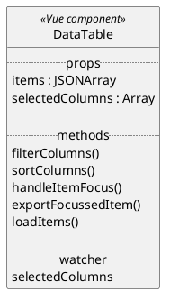
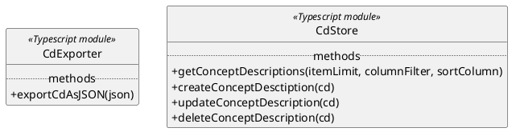
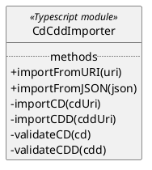
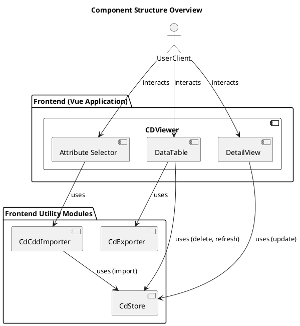
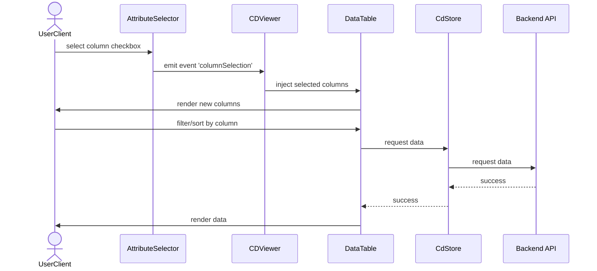
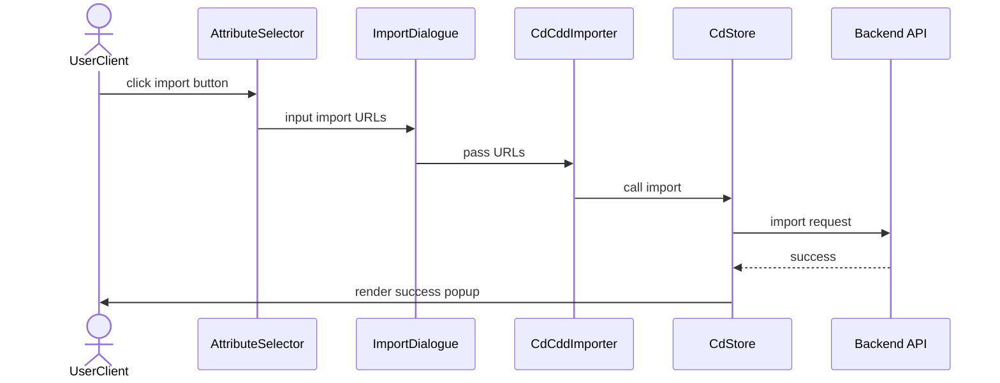
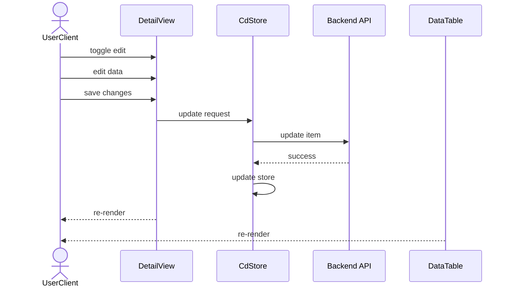
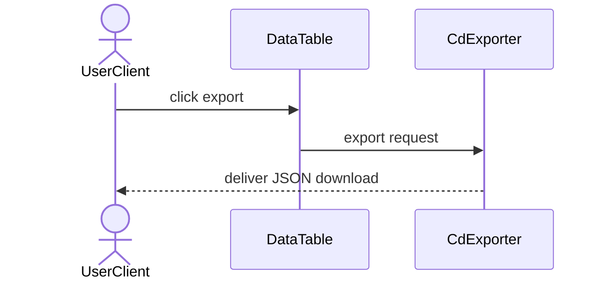
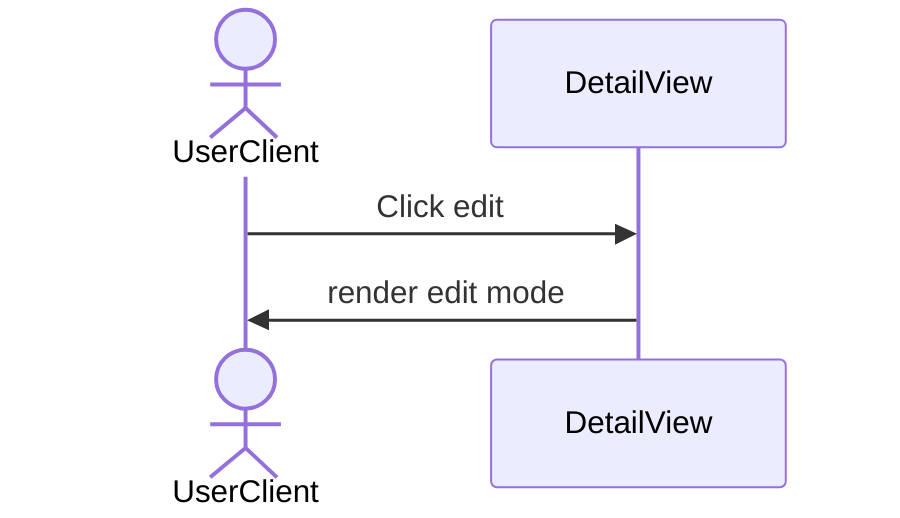

# Version Control

| **Version** | **Datum**  | **Autor**   | **Anmerkung** |
|-------------|------------|-------------|---------------|
| 0.1         | 15.11.2025 | Christopher | Draft 1       |
| 0.2         | 15.11.2025 | Christopher | Draft 2       |
| 0.3         | 15.11.2025 | Christopher | Draft 3       |
| 0.4         | 16.11.2025 | Christopher | Draft 4       |

# 1 Introduction

## 1.1 Purpose

This System Architecture Specification (SAS) describes the planned extension of an already existing System from an
architectural point of view.
The goal is to provide technical insights for the realization of the features described in
the [Customer Requirement Specification (CRS)](../CRS.md)
and [Software Requirement Specification (SRS)](../SRS/TINF24F_SRS_Team_1_1v0.md) for developers (devs), software testers
and project owners (POs).

## 1.2 Scope

The goal of this project is to extend the Concept Description (CD) capabilities of the Eclipse BaSyx Ecosystem.

**Following features are in-scope for this project:**  
1. **_SRS-1:_** Extension of the Web UIs header navigation to a new CD view
2. **_SRS-2:_** CD data table to display all available CDs
3. **_SRS-3:_** Attribute Selector for the CD data table
4. **_SRS-4:_** Detail view of specific CDs
5. **_SRS-5:_** Creation and Import of CDs into the CD repository
6. **_UC-1:_** Find CD in data table

**Following features are out of scope for this project:**

- Extending the CD repository (Java Backend and API)
- Modifying the CD database scheme

In short only the Web UI will be enxtended, while the rest of the infrastructure will remain unchanged.

## 1.3 Definitions, Acronyms, Abbreviations

| Full name                          | Acronym/Abbreviation singular | Acronym/Abbreviation plural |
|------------------------------------|-------------------------------|-----------------------------|
| System Architecture Specification  | SAS                           | -                           |
| Customer Requirement Specification | CRS                           | -                           |
| Software Requirement Specification | SRS                           | -                           |
| Project Owner                      | PO                            | POs                         |
| Developer                          | dev                           | devs                        |
| User Interface                     | UI                            | UIs                         |
| Database                           | DB                            | DBs                         |
| Repository                         | repo                          | repos                       |
| Asset Administration Shell         | AAS                           | AASs                        |
| Concept Description                | CD                            | CDs                         |
| Common Data Dictionary             | CDD                           | CDDs                        |

# 2 System Overview

## 2.1 System Structure (black-box)

Currently, the system consist of three Individual components:

- Eclipse BaSyx Web UI
- Eclipse BaSyx CD repo - backend
- Eclipse BaSyx CD repo - database


Below are some references to valuable information about the components

| Web UI                  | Name               | References                                                                |
|-------------------------|--------------------|---------------------------------------------------------------------------|
| GitHub repo             | basyx-aas-web-ui   | [repo link](https://github.com/eclipse-basyx/basyx-aas-web-ui)            |
| Web server & Build tool | Vite               | [Vite Introduction](https://vite.dev/guide/#overview)                     |
| JavaScript Framework    | Vue.js (Abbr. Vue) | [Vue Introduction](https://vuejs.org/guide/introduction.html#what-is-vue) |
|                         | Yarn               |                                                                           |
|                         | eslint             |                                                                           |

| Java Backend                       | Name                  | References                                                                                                       |
|------------------------------------|-----------------------|------------------------------------------------------------------------------------------------------------------|
| GitHub repo                        | basyx-java-server-sdk | [repo link](https://github.com/eclipse-basyx/basyx-java-server-sdk/tree/main/basyx.conceptdescriptionrepository) |       
| Java Framework                     | Spring Boot           | [Spring Boot Introduction](https://spring.io/projects/spring-boot#overview)                                      |
| Dependency management & Build tool | Maven                 | [Maven Introduction](https://maven.apache.org/)                                                                  |

| Database         | Name    | References                                                                                                                                 |
|------------------|---------|--------------------------------------------------------------------------------------------------------------------------------------------|
| In-Memory        | unknown | [repo link](https://github.com/eclipse-basyx/basyx-java-server-sdk/tree/main/basyx.common/basyx.authorization.rules.rbac.backend.inmemory) |
| Docker Container | MongoDB | [repo link](https://github.com/eclipse-basyx/basyx-java-server-sdk/tree/main/basyx.common/basyx.filerepository-backend-mongodb)            |

## 2.2 System Architecture (white-box)

### 2.2.1 Module derivation

**_SRS-1: View navigation_**  
Users should be able to use the already established navigation to find the view for managing CDs.  
Here the architecture requires the addition of a new view and an additional category in the navigation panel.


**_SRS-2: Display data in Data Table_**  
In the CD view a user should be able to see all CDs listed in a data table, which shall be provided as a new component.  
This component should support **filter**, **sort** and **interaction features** as specified in the [SRS - Datatable](../SRS/TINF24F_SRS_Team_1_1v0.md#3-datentabelle-required).




**_SRS-3: Data Table adaptation_**  
The attribute selector is a sidebar which can be collapsed to the side with an integrated collapse button.  
It should support multiple features such as adapting the displayed CD data table columns dynamically and offering buttons to **import CDs and CDDs**, **clone a full CD repo** and **collapsing the sidebar** as specified in the [SRS - Attribute Selector](../SRS/TINF24F_SRS_Team_1_1v0.md#2-attribut-selector-required).  
For this functionality a new component will be implemented:


**_SRS-4: Detail View of CD_**  
A detail view is required to support the detailed inspection of a CDs data and provide the possibility to edit it directly in that view.
For this a CD focussed in the Table should be displayed to the right of the table.  
Here a new component must be implemented:


**_SRS-5: Create and Import CDs_**  
The **creation** and **import** of CDs and CDDs can be accessed by the attribute selector's **import button** and requires additional validation logic for data quality and data integrity.  
This requires a new importer component for CDs and CDDs which also takes care of validating the data:



### 2.2.2 Module hierarchy

Vue components communicate only with their direct parent- or children components over properties (props) and events.  
Emitted events can transport data up to the parent where it can be consumed immediately or passed down to another child by injecting it into a child's property.


Using Vue's communication concept is very important to make use of its reactive rendering features.  
Taking Vue's communication concept into account, the following component structure has been proposed.


## 2.3 Communication Architecture

[//]: # (```mermaid)

[//]: # (sequenceDiagram)

[//]: # (    actor UC as UserClient)

[//]: # (    participant AS as AttributeSelector)

[//]: # (    participant CDV as CDViewer)

[//]: # (    participant DT as DataTable)

[//]: # (    participant DV as DetailView)

[//]: # (    participant EXPO as CdExporter)

[//]: # (    participant IDL as ImportDialogue)

[//]: # (    participant IMP as CdCddImporter)

[//]: # (    participant Store as CdStore)

[//]: # (    participant API as Backend API)

[//]: # ()
[//]: # (    UC->>AS: select column checkbox)

[//]: # (    AS->>CDV: emit event 'columnSelection')

[//]: # (    CDV->>DT: inject selected columns)

[//]: # (    DT->>UC: render new columns)

[//]: # ()
[//]: # (    UC->>AS: click import button)

[//]: # (    AS->>IDL: input import URLs)

[//]: # (    IDL->>IMP: pass URLs)

[//]: # (    IMP->>Store: call import)

[//]: # (    Store->>API: import request)

[//]: # (    API-->>Store: success)

[//]: # (    Store-->>DT: update store)

[//]: # (    DT->>UC: render new items)

[//]: # ()
[//]: # (    UC->>DT: click export)

[//]: # (    DT->>EXPO: export request)

[//]: # (    EXPO-->>UC: deliver JSON download)

[//]: # ()
[//]: # (    UC->>DT: click table item)

[//]: # (    DT->>CDV: emit itemFocused)

[//]: # (    CDV->>DV: inject item)

[//]: # (    DV->>UC: render detail view)

[//]: # ()
[//]: # (    UC->>DV: Click edit)

[//]: # (    DV->>UC: render edit mode)

[//]: # ()
[//]: # (    UC->>DV: Save changes)

[//]: # (    DV->>Store: update request)

[//]: # (    Store->>API: update item)

[//]: # (    API-->>Store: success)

[//]: # (    Store-->>DV: update store)

[//]: # (    DV->>DT: emit updated)

[//]: # (    DT->>UC: render updated item)

[//]: # (```)
**_UC-1: Find, filter and sort CDs_**

**_UC-2: Create, update and delete CDs_**




