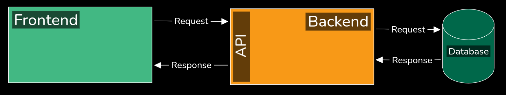
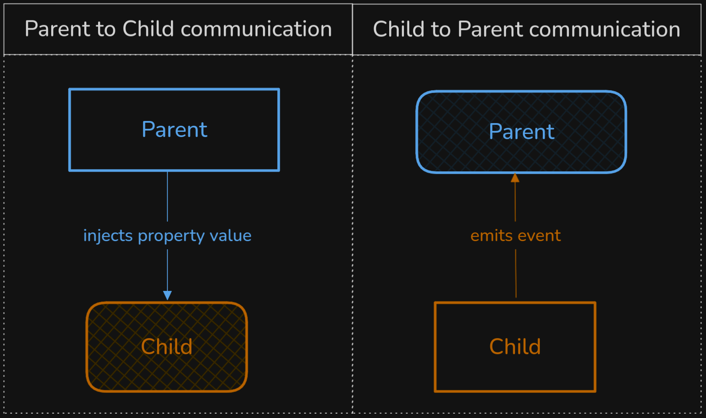
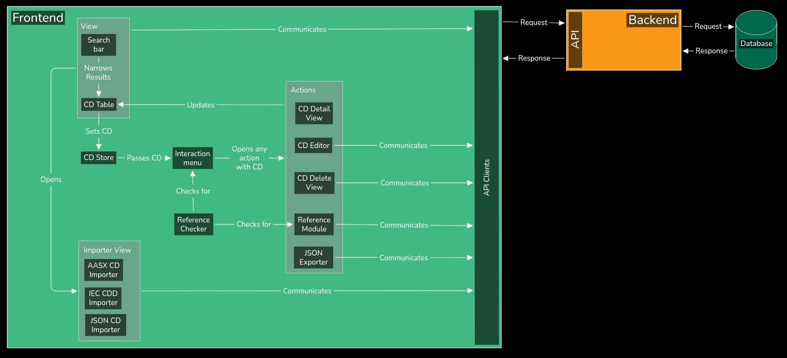
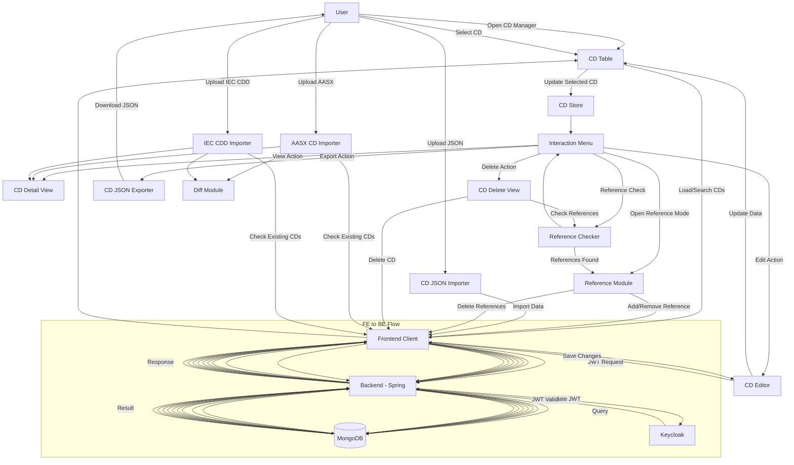
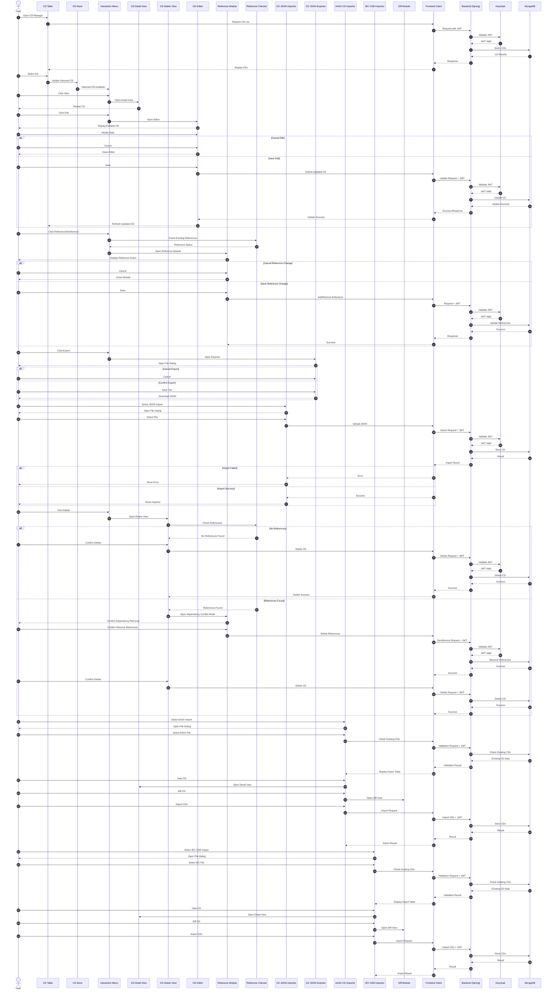

# Software Architecture Specification (SAS) - BaSyx ConceptDescription-Plugin (CD-Manager)

# Version Control

| **Version** | **Datum**  | **Autor**   | **Anmerkung**                         |
|-------------|------------|-------------|---------------------------------------|
| 0.1         | 15.11.2025 | Christopher | Draft 1                               |
| 0.2         | 15.11.2025 | Christopher | Draft 2                               |
| 0.3         | 15.11.2025 | Christopher | Draft 3                               |
| 0.4         | 16.11.2025 | Christopher | Draft 4                               |
| 1.0         | 16.11.2025 | Christopher | Version 1                             |
| 2.0         | 18.11.2025 | Christopher | Added Chapter 2.2.1                   |
| 3.0         | 11.05.2026 | Christopher | Refactoring the software architecture |

# Table of Contents

<!-- TOC -->
* [Software Architecture Specification (SAS) - BaSyx ConceptDescription-Plugin (CD-Manager)](#software-architecture-specification-sas---basyx-conceptdescription-plugin-cd-manager)
* [Version Control](#version-control)
* [Table of Contents](#table-of-contents)
* [Introduction](#introduction)
  * [Definitions, Acronyms, Abbreviations](#definitions-acronyms-abbreviations)
  * [Purpose](#purpose)
  * [Scope](#scope)
* [Black-box Structure](#black-box-structure)
* [Technology](#technology)
  * [Tech Stack](#tech-stack)
    * [Vue - Important Features to consider using](#vue---important-features-to-consider-using)
    * [TypeScript](#typescript)
  * [Concepts to utilize](#concepts-to-utilize)
  * [Technological Restrictions](#technological-restrictions)
  * [Component hierarchy](#component-hierarchy)
* [White-box Structure](#white-box-structure)
  * [Module derivation](#module-derivation)
    * [MOD-1 - CD Table](#mod-1---cd-table)
      * [Preliminary considerations](#preliminary-considerations)
      * [Details](#details)
      * [References](#references)
    * [MOD-2 - CD Store](#mod-2---cd-store)
      * [Preliminary considerations](#preliminary-considerations-1)
      * [Details](#details-1)
      * [References](#references-1)
    * [MOD-3 - Interaction menu](#mod-3---interaction-menu)
      * [Preliminary considerations](#preliminary-considerations-2)
      * [Details](#details-2)
      * [References](#references-2)
    * [MOD-4 - CD Detail View](#mod-4---cd-detail-view)
      * [Preliminary considerations](#preliminary-considerations-3)
      * [Details](#details-3)
      * [References](#references-3)
    * [MOD-5 - CD Editor](#mod-5---cd-editor)
      * [Preliminary considerations](#preliminary-considerations-4)
      * [Details](#details-4)
      * [References](#references-4)
    * [MOD-6 - Reference Module](#mod-6---reference-module)
      * [Preliminary considerations](#preliminary-considerations-5)
      * [Details](#details-5)
      * [References](#references-5)
    * [MOD-7 - CD JSON exporter](#mod-7---cd-json-exporter)
      * [Preliminary considerations](#preliminary-considerations-6)
      * [Details](#details-6)
      * [References](#references-6)
    * [MOD-8 - CD Delete View](#mod-8---cd-delete-view)
      * [Preliminary considerations](#preliminary-considerations-7)
      * [Details](#details-7)
      * [References](#references-7)
    * [MOD-9 - Reference Checker](#mod-9---reference-checker)
      * [Preliminary considerations](#preliminary-considerations-8)
      * [Details](#details-8)
      * [References](#references-8)
    * [MOD-10 - AASX CD Importer](#mod-10---aasx-cd-importer)
      * [Preliminary considerations](#preliminary-considerations-9)
      * [Details](#details-9)
      * [References](#references-9)
    * [MOD-11 - IEC CDD Importer](#mod-11---iec-cdd-importer)
      * [Preliminary considerations](#preliminary-considerations-10)
      * [Details](#details-10)
      * [References](#references-10)
    * [MOD-12 - JSON Importer](#mod-12---json-importer)
      * [Preliminary considerations](#preliminary-considerations-11)
      * [Details](#details-11)
      * [References](#references-11)
  * [White box diagram](#white-box-diagram)
  * [Communication Diagram](#communication-diagram)
* [Sequence Diagram](#sequence-diagram)
* [Outlook](#outlook)
<!-- TOC -->

# Introduction

## Definitions, Acronyms, Abbreviations

| Full name                          | Acronym/Abbreviation singular | Acronym/Abbreviation plural |
|------------------------------------|-------------------------------|-----------------------------|
| System Architecture Specification  | SAS                           | -                           |
| Customer Requirement Specification | CRS                           | -                           |
| Software Requirement Specification | SRS                           | -                           |
| Project Owner                      | PO                            | POs                         |
| Developer                          | Dev                           | Devs                        |
| User Interface                     | UI                            | UIs                         |
| Database                           | DB                            | DBs                         |
| Repository                         | Repo                          | Repos                       |
| Asset Administration Shell         | AAS                           | AAS                         |
| Concept Description                | CD                            | CDs                         |
| Embedded Data Specification        | EDS                           | -                           |
| Common Data Dictionary             | CDD                           | -                           |
| Document Object Model              | DOM                           | DOMs                        |

## Purpose

This System Architecture Specification (SAS) describes the planned extension of an already existing System from an
architectural point of view.  
The goal is to provide technical insights for the realization of the features described in
the [Customer Requirement Specification (CRS)](../CRS/TINF24F_1-CRS-6v0.md)
and [Software Requirement Specification (SRS)](../SRS/TINF24F_1-SRS-2v0.md)
for developers (devs), software testers and project owners (POs).

## Scope

The goal of this project is to extend the capabilities to work with and maintain Concept Descriptions (CD) from the
Eclipse BaSyx Web UI.

**Following requirements are in-scope for this project:**

1. [FR-1 - CDs in Tabelle anzeigen sowie suchen und filtern](../SRS/TINF24F_1-SRS-2v0.md#fr-1---cds-in-tabelle-anzeigen-sowie-suchen-und-filtern)
2. [FR-2 - Interaktionen auf einzelnen CDs über Ineraktions-Menü](../SRS/TINF24F_1-SRS-2v0.md#fr-2---interaktionen-auf-einzelnen-cds-über-ineraktions-menü)
3. [FR-3 - Detail-Ansicht für CDs](../SRS/TINF24F_1-SRS-2v0.md#fr-3---detail-ansicht-für-cds)
4. [FR-4 - Editor-Ansicht für CDs](../SRS/TINF24F_1-SRS-2v0.md#fr-4---editor-ansicht-für-cds)
5. [FR-5 - Import Funktion für CDs über AASX](../SRS/TINF24F_1-SRS-2v0.md#fr-5---import-funktion-für-cds-über-aasx)
6. [FR-6 - Import Funktion für IECs als CD](../SRS/TINF24F_1-SRS-2v0.md#fr-6---import-funktion-für-iecs-als-cd)
6. [FR-7 - Export Funktion für CDs](../SRS/TINF24F_1-SRS-2v0.md#fr-7---export-funktion-für-cds)
6. [FR-8 - Referenzierung von CDs in SMS](../SRS/TINF24F_1-SRS-2v0.md#fr-8---referenzierung-von-cds-in-sms)
7. [FR-9 - Differenz- und Detailansicht für AASX CDs und IEC Import](../SRS/TINF24F_1-SRS-2v0.md#fr-9---differenz--und-detailansicht-für-aasx-cds-und-iec-import)
7. [FR-10 - Löschen einzelner CDs aus dem CD repository](../SRS/TINF24F_1-SRS-2v0.md#fr-10---löschen-einzelner-cds-aus-dem-cd-repository)
7. [FR-11 - CDs über JSON Datei importieren](../SRS/TINF24F_1-SRS-2v0.md#fr-11---cds-über-json-datei-importieren)

**Following features are out of scope for this project:**

- Extending the CD repository (Java Backend and API)
- Modifying the CD database scheme

In short only the Web UI will be extended, while the rest of the infrastructure will remain unchanged.

# Black-box Structure

Currently, the system consist of four Individual components:

- Eclipse BaSyx Web UI
- Eclipse BaSyx CD repo - backend
- Eclipse BaSyx CD repo - database
- Keycloak as Identity Provider

Below are some references to valuable information about the components

| Web UI                  | Name               | References                                                                |
|-------------------------|--------------------|---------------------------------------------------------------------------|
| GitHub repo             | basyx-aas-web-ui   | [repo link](https://github.com/eclipse-basyx/basyx-aas-web-ui)            |
| Web server & Build tool | Vite               | [Vite Introduction](https://vite.dev/guide/#overview)                     |
| JavaScript Framework    | Vue.js (Abbr. Vue) | [Vue Introduction](https://vuejs.org/guide/introduction.html#what-is-vue) |
| Dependency management   | pnpm               | [pnpm Homepage](https://pnpm.io/motivation)                               |
| Static code analyzer    | ESLint             | [ESLint Homepage](https://eslint.org/)                                    |

| Java Backend                       | Name                  | References                                                                                                       |
|------------------------------------|-----------------------|------------------------------------------------------------------------------------------------------------------|
| GitHub repo                        | basyx-java-server-sdk | [repo link](https://github.com/eclipse-basyx/basyx-java-server-sdk/tree/main/basyx.conceptdescriptionrepository) |       
| Java Framework                     | Spring Boot           | [Spring Boot Introduction](https://spring.io/projects/spring-boot#overview)                                      |
| Dependency management & Build tool | Maven                 | [Maven Introduction](https://maven.apache.org/)                                                                  |

| Database         | Name    | References                                                                                                                       |
|------------------|---------|----------------------------------------------------------------------------------------------------------------------------------|
| In-Memory        | unknown | [repo link](https://github.com/eclipse-basyx/basyx-java-server-sdk/tree/main/basyx.common/basyx.filerepository-backend-inmemory) |
| Docker Container | MongoDB | [repo link](https://github.com/eclipse-basyx/basyx-java-server-sdk/tree/main/basyx.common/basyx.filerepository-backend-mongodb)  |

# Technology

## Tech Stack

This tech stack only contains the technologies used to implement the requirements of
the [CRS](../CRS/TINF24F_1-CRS-6v0.md) and [SRS](../SRS/TINF24F_1-SRS-2v0.md) in the Web UI.

The other Components of the Black Box structure are essential to make this feature work, but are already integrated and
will be used via an abstraction layer inside the frontend.

### Vue - Important Features to consider using

- Vue components - Vue supports Components to encourage Modular architecture. Separating the UI into separate
  components is desired due to maintainability and reusability.
- Vue reactivity - Vue provides a strong automatic reactivity engine, removing the need for manual state- and DOM
  updates. This keeps the UI up to date without much opportunity to introduce faulty updates and rendering.
- Vue component communication - Components can make use of Vue's reactivity capabilities by communicating over events
  and props. A deliberately chosen hierarchical structure of all components makes it easy to make use of Vue's
  reactivity.
- TypeScript Modules - TypeScript Modules help separating component functionality and business logic. This
  allows for future adaptation of component functionality and business logic independently as well as reusability in
  any other component on demand.

### TypeScript

- Data Typing - TypeScript itself only extends JavaScript by the capability to Perform strong typing while the code is
  written. This will come in handy when defining input and output for component interfaces.

## Concepts to utilize

- Store - Stores centralize data management, as single point of truth they handle state updates for all components
  simultaneously. This is especially useful to avoid data being out of sync between multiple components.

## Technological Restrictions

- The Web UI integrated the store differently to what was expected. Generally the Store is the single access point for
  data. In the Web UI this is now the job of so-called "Clients". The Store itself only manages the state of the
  currently selected object.
- Every functionality is not only restricted by the capabilities defined in the AAS-Standard, but also by the
  capabilities of the frontend, as the Backend is out of scope for this project.

## Component hierarchy

Vue components communicate only with their direct parent- or children components over properties (props) and events.  
Emitted events can transport data up to the parent where it can be consumed immediately or passed down to another child
by injecting it into a child's property.

Using Vue's communication concept is very important to make use of its reactive rendering features.

# White-box Structure

## Module derivation

**DISCLAIMER:**  
The modules are not derived from single Functional Requirements (FR) and they are not restricted to consist of a single
file or Vue component.  
Every reference made to functional requirements, use cases or other derived modules, is based on a purely technical
point of view and may not always make sense for non-developers.

### MOD-1 - CD Table

#### Preliminary considerations

The Web UI already features the capabilities to communicate with the CD repository over its REST API.
In the BaSyx Web UI this functionality is bundled in "Clients", which also take care of decorating every request with
authentication tokens if security is required.
The Store generally focusses on managing the entity that is selected by the user, may that be the AAS you want to view
or the SubmodelElement in the tree view.

#### Details

All requests, the AAS-Standard defined, for the REST API, to support working with CDs, are already implemented in the
Client modules.
Therefore, this module with make use of the Client as tool to communicate with the CD repository.

#### References

**Derived from:**

- [FR-1](../SRS/TINF24F_1-SRS-2v0.md#fr-1---cds-in-tabelle-anzeigen-sowie-suchen-und-filtern) & [UC-1](../CRS/TINF24F_1-CRS-6v0.md#uc-1-cds-in-tabelle-und-tabellenseiten-auflisten-und-suchenfiltern)
  (CDs in Tabelle anzeigen sowie suchen und filtern)

**Other functional requirements and use cases linked to this module:**

- [FR-2](../SRS/TINF24F_1-SRS-2v0.md#fr-2---interaktionen-auf-einzelnen-cds-über-ineraktions-menü) & [UC-2](../CRS/TINF24F_1-CRS-6v0.md#uc-2-tabellen-interaktionen-auf-einzelnen-cds)
  (Tabellen-interaktionen auf einzelnen CDs)
- [FR-4](../SRS/TINF24F_1-SRS-2v0.md#fr-4---editor-ansicht-für-cds) & [UC-4](../CRS/TINF24F_1-CRS-6v0.md#uc-4-editor-ansicht-für-cds)
  (Editor-Ansicht für CDs)
- [FR-7](../SRS/TINF24F_1-SRS-2v0.md#fr-7---export-funktion-für-cds) & [UC-7](../CRS/TINF24F_1-CRS-6v0.md#uc-7-export-funktion-für-cds)
  (Export Funktion für CDs)
- [FR-8](../SRS/TINF24F_1-SRS-2v0.md#fr-8---referenzierung-von-cds-in-sms) & [UC-8](../CRS/TINF24F_1-CRS-6v0.md#uc-8-referenzierung-von-cds-in-submodellen)
  (Referenzierung von CDs in Submodellen)

---

### MOD-2 - CD Store

#### Preliminary considerations

Due to the Web UI using stores only to manage the data elements selected (with the click of a mouse) in the UI, this
store is going to do the exact same for CDs.
There are already other stores to use as inspiration for the internal code structure and functionality.

#### Details

As the Web UI already features stores, the CD store has to adhere to the same structure, functionality and
responsibility as the other stores.
Going further than the other stores in terms of functionality and responsibility is not desired.

#### References

**Derived from:**

- [FR-2](../SRS/TINF24F_1-SRS-2v0.md#fr-2---interaktionen-auf-einzelnen-cds-über-ineraktions-menü) & [UC-2](../CRS/TINF24F_1-CRS-6v0.md#uc-2-tabellen-interaktionen-auf-einzelnen-cds)
  (Tabellen-interaktionen auf einzelnen CDs)

**Other functional requirements and use cases linked to this module:**

- [FR-1](../SRS/TINF24F_1-SRS-2v0.md#fr-1---cds-in-tabelle-anzeigen-sowie-suchen-und-filtern) & [UC-1](../CRS/TINF24F_1-CRS-6v0.md#uc-1-cds-in-tabelle-und-tabellenseiten-auflisten-und-suchenfiltern)
  (CDs in Tabelle anzeigen sowie suchen und filtern)
- [FR-3](../SRS/TINF24F_1-SRS-2v0.md#fr-3---detail-ansicht-für-cds) & [UC-3](../CRS/TINF24F_1-CRS-6v0.md#uc-3-detail-ansicht-für-cds)
  (Detail-Ansicht für CDs)
- [FR-4](../SRS/TINF24F_1-SRS-2v0.md#fr-4---editor-ansicht-für-cds) & [UC-4](../CRS/TINF24F_1-CRS-6v0.md#uc-4-editor-ansicht-für-cds)
  (Editor-Ansicht für CDs)
- [FR-7](../SRS/TINF24F_1-SRS-2v0.md#fr-7---export-funktion-für-cds) & [UC-7](../CRS/TINF24F_1-CRS-6v0.md#uc-7-export-funktion-für-cds)
  (Export Funktion für CDs)
- [FR-8](../SRS/TINF24F_1-SRS-2v0.md#fr-8---referenzierung-von-cds-in-sms) & [UC-8](../CRS/TINF24F_1-CRS-6v0.md#uc-8-referenzierung-von-cds-in-submodellen)
  (Referenzierung von CDs in Submodellen)

---

### MOD-3 - Interaction menu

#### Preliminary considerations

There is no component available that covers the functionalities, this module should support.
The "Reference" and "Dereference" actions will have to be evaluated dynamically based on the selected SM and CD.

#### Details

As there is no existing component already covering this functionality this one must be developed from the ground up.
Evaluating the current SM to CD reference status should be supported by the stores for SMs and CDs.
If the stores are not capable of supporting the dynamic reference checking, this module must use the API to check
existing references.

#### References

**Derived from:**

- [FR-2](../SRS/TINF24F_1-SRS-2v0.md#fr-2---interaktionen-auf-einzelnen-cds-über-ineraktions-menü) & [UC-2](../CRS/TINF24F_1-CRS-6v0.md#uc-2-tabellen-interaktionen-auf-einzelnen-cds)
  (Interaktionen auf einzelnen CDs über Ineraktions-Menü)

**Other functional requirements and use cases linked to this module:**

- [FR-3](../SRS/TINF24F_1-SRS-2v0.md#fr-3---detail-ansicht-für-cds) & [UC-3](../CRS/TINF24F_1-CRS-6v0.md#uc-3-detail-ansicht-für-cds)
  (Detail-Ansicht für CDs)
- [FR-4](../SRS/TINF24F_1-SRS-2v0.md#fr-4---editor-ansicht-für-cds) & [UC-4](../CRS/TINF24F_1-CRS-6v0.md#uc-4-editor-ansicht-für-cds)
  (Editor-Ansicht für CDs)
- [FR-7](../SRS/TINF24F_1-SRS-2v0.md#fr-7---export-funktion-für-cds) & [UC-7](../CRS/TINF24F_1-CRS-6v0.md#uc-7-export-funktion-für-cds)
  (Export Funktion für CDs)
- [FR-8](../SRS/TINF24F_1-SRS-2v0.md#fr-8---referenzierung-von-cds-in-sms) & [UC-8](../CRS/TINF24F_1-CRS-6v0.md#uc-8-referenzierung-von-cds-in-submodellen)
  (Referenzierung von CDs in Submodellen)
- [FR-10](../SRS/TINF24F_1-SRS-2v0.md#fr-10---löschen-einzelner-cds-aus-dem-cd-repository) & [UC-9](../CRS/TINF24F_1-CRS-6v0.md#uc-9-löschen-einzelner-cds-aus-dem-cd-repository)
  (Löschen einzelner CDs aus dem CD repository)

---

### MOD-4 - CD Detail View

#### Preliminary considerations

In the Web UI there is already a feature to display CDs reliably with all the available information.
This thankfully is already a Vue component.
Therefore, reinventing the wheel is not necessary and this component can be used to satisfy the need to display CD
information.

#### Details

As this component already exists, it must be integrated into the desired "Detail View" functionality for every module
requiring it.
The component MUST not be changed for the purpose of displaying CD data as it already works well, thanks to the
Eclipse-BaSyx team.
Integration should follow the Vue.js basic design
pattern [Vue Components](https://vuejs.org/guide/essentials/component-basics.html).

#### References

**Derived from:**

- [FR-3](../SRS/TINF24F_1-SRS-2v0.md#fr-3---detail-ansicht-für-cds) & [UC-3](../CRS/TINF24F_1-CRS-6v0.md#uc-3-detail-ansicht-für-cds)
  (Detail-Ansicht für CDs)

**Other functional requirements and use cases linked to this module:**

- [FR-2](../SRS/TINF24F_1-SRS-2v0.md#fr-2---interaktionen-auf-einzelnen-cds-über-ineraktions-menü) & [UC-2](../CRS/TINF24F_1-CRS-6v0.md#uc-2-tabellen-interaktionen-auf-einzelnen-cds)
  (Tabellen-interaktionen auf einzelnen CDs)
- [FR-5](../SRS/TINF24F_1-SRS-2v0.md#fr-5---import-funktion-für-cds-über-aasx) & [UC-5](../CRS/TINF24F_1-CRS-6v0.md#uc-5-import-funktion-für-cd-über-aasx)
  (Import Funktion für CDs über AASX)
- [FR-6](../SRS/TINF24F_1-SRS-2v0.md#fr-6---import-funktion-für-iecs-als-cd) & [UC-6](../CRS/TINF24F_1-CRS-6v0.md#uc-6-import-funktion-für-iecs-als-cd)
  (Import Funktion für IECs als CD)

---

### MOD-5 - CD Editor

#### Preliminary considerations

For this editor, there is no component like this already available in the Web UI.
Still the component used for displaying the CD data can be adapted to support an editor mode which is turned off by
default.
This will keep the look and feel consistent and does not disturb any other feature using the display component normally.

#### Details

The Editor view should be an extension of the actual display component and must be turned off by default.
The Editor view MUST not alter the default behavior of the Display component in any way, except when it is explicitly
put into editor mode.

#### References

**Derived from:**

- [FR-10](../SRS/TINF24F_1-SRS-2v0.md#fr-10---löschen-einzelner-cds-aus-dem-cd-repository) & [UC-9](../CRS/TINF24F_1-CRS-6v0.md#uc-9-löschen-einzelner-cds-aus-dem-cd-repository)
  (Löschen einzelner CDs aus dem CD repository)

**Other functional requirements and use cases linked to this module:**

- [FR-2](../SRS/TINF24F_1-SRS-2v0.md#fr-2---interaktionen-auf-einzelnen-cds-über-ineraktions-menü) & [UC-2](../CRS/TINF24F_1-CRS-6v0.md#uc-2-tabellen-interaktionen-auf-einzelnen-cds)
  (Interaktionen auf einzelnen CDs über Ineraktions-Menü)

---

### MOD-6 - Reference Module

#### Preliminary considerations

For referencing and dereferencing the actual state of what is already referenced and what not, must be determined.
The SM repository REST API must be used to determine the state.
There are some extra TypeScript modules, that could contain useful functionalities beyond the capabilities of the SM
Client.

#### Details

A dereference action must only remove the reference element from the SM, not the CD itself.
A reference action must update the SM accordingly and should update trigger an update to the tree view for SMs.
There should be a display of the CD and SM targeted for this action.
For both there is already a Vue component to display them, those should be reused.

#### References

**Derived from:**

- [FR-8](../SRS/TINF24F_1-SRS-2v0.md#fr-8---referenzierung-von-cds-in-sms) & [UC-8](../CRS/TINF24F_1-CRS-6v0.md#uc-8-referenzierung-von-cds-in-submodellen)
  (Referenzierung von CDs in Submodellen)

**Other functional requirements and use cases linked to this module:**

- [FR-2](../SRS/TINF24F_1-SRS-2v0.md#fr-2---interaktionen-auf-einzelnen-cds-über-ineraktions-menü) & [UC-2](../CRS/TINF24F_1-CRS-6v0.md#uc-2-tabellen-interaktionen-auf-einzelnen-cds)
  (Interaktionen auf einzelnen CDs über Ineraktions-Menü)

---

### MOD-7 - CD JSON exporter

#### Preliminary considerations

The JSON file should ideally be importable too.
An extra module is required to allow re-importing those CDs without having to create a shell around it (an issue we
already ran into).
Before this can be implemented, it must be checked, if the Web UI already features an export functionality we can
re-use.

#### Details

The JSON file must be of a BaSyx compatible format.
The data must be exported completely to ensure the data is in a valid state for re-importing.
If a JSON export functionality already exists, it should be re-used for this module if feasible.

#### References

**Derived from:**

- [FR-7](../SRS/TINF24F_1-SRS-2v0.md#fr-7---export-funktion-für-cds) & [UC-7](../CRS/TINF24F_1-CRS-6v0.md#uc-7-export-funktion-für-cds)
  (Export Funktion für CDs)

**Other functional requirements and use cases linked to this module:**

- none

---

### MOD-8 - CD Delete View

#### Preliminary considerations

This functionality is basically the Detail view just that it can delete CDs.
The already existing component used by the detail view can be used here as well.
This should not extend the detail view to allow independent maintainability.

#### Details

A new component must be created to ensure isolated maintainability.
Delete actions should use [MOD-9](#mod-9---reference-checker) to check dependency conflicts for SMs that still
reference this CD

#### References

**Derived from:**

- [FR-10](../SRS/TINF24F_1-SRS-2v0.md#fr-10---löschen-einzelner-cds-aus-dem-cd-repository) & [UC-9](../CRS/TINF24F_1-CRS-6v0.md#uc-9-löschen-einzelner-cds-aus-dem-cd-repository)
  (Löschen einzelner CDs aus dem CD repository)

**Other functional requirements and use cases linked to this module:**

- none

---

### MOD-9 - Reference Checker

#### Preliminary considerations

References are nested, so the SM repository must be queried a lot before this module can give an answer.

#### Details

References must be found in the SM repository using the Client for SM API.
All SMs containing the reference must be part of the response.
This will be a non-visual module.

#### References

**Derived from:**

- [FR-8](../SRS/TINF24F_1-SRS-2v0.md#fr-8---referenzierung-von-cds-in-sms) & [UC-8](../CRS/TINF24F_1-CRS-6v0.md#uc-8-referenzierung-von-cds-in-submodellen)
  (Referenzierung von CDs in Submodellen)
- [FR-10](../SRS/TINF24F_1-SRS-2v0.md#fr-10---löschen-einzelner-cds-aus-dem-cd-repository) & [UC-9](../CRS/TINF24F_1-CRS-6v0.md#uc-9-löschen-einzelner-cds-aus-dem-cd-repository)
  (Löschen einzelner CDs aus dem CD repository)

**Other functional requirements and use cases linked to this module:**

- none

---

### MOD-10 - AASX CD Importer

#### Preliminary considerations

There is already a functionality for importing AASX files.
Only CDs and EDS should be imported.

#### Details

The existing AASX import functionality should be used and adapted to optionally ignore everything that is not a CD or
EDS.
The user should be able to decide which CDs and EDS they want to import.
There should be a diff functionality and a detail view for the user so they can decide which CD to import.

#### References

**Derived from:**

- [FR-5](../SRS/TINF24F_1-SRS-2v0.md#fr-5---import-funktion-für-cds-über-aasx) & [UC-5](../CRS/TINF24F_1-CRS-6v0.md#uc-5-import-funktion-für-cd-über-aasx)
  (Import Funktion für CD über AASX)
- [FR-9](../SRS/TINF24F_1-SRS-2v0.md#fr-9---differenz--und-detailansicht-für-aasx-cds-und-iec-import)
  (Import Funktion für CD über AASX)

**Other functional requirements and use cases linked to this module:**

- [FR-3](../SRS/TINF24F_1-SRS-2v0.md#fr-3---detail-ansicht-für-cds) & [UC-3](../CRS/TINF24F_1-CRS-6v0.md#uc-3-detail-ansicht-für-cds)
  (Detail-Ansicht für CDs)

---

### MOD-11 - IEC CDD Importer

#### Preliminary considerations

There is no functionality like this already implemented.
IEC CDD files can not be extracted via code.
IEC CDD files only come in Excel files.

#### Details

A new Component should be implemented which accepts IEC CDD files in Excel format.
Excel files should be parsed into valid CDs.
There should be a multi-file upload functionality.
All found CDs should be selectable, viewable in normal and in diffs analogous to
the [MOD-10](#mod-10---aasx-cd-importer).

#### References

**Derived from:**

- [FR-6](../SRS/TINF24F_1-SRS-2v0.md#fr-6---import-funktion-für-iecs-als-cd) & [UC-6](../CRS/TINF24F_1-CRS-6v0.md#uc-6-import-funktion-für-iecs-als-cd)
  (Import Funktion für IECs als CD)

**Other functional requirements and use cases linked to this module:**

- [FR-3](../SRS/TINF24F_1-SRS-2v0.md#fr-3---detail-ansicht-für-cds) & [UC-3](../CRS/TINF24F_1-CRS-6v0.md#uc-3-detail-ansicht-für-cds)
  (Detail-Ansicht für CDs)

---

### MOD-12 - JSON Importer

#### Preliminary considerations

There is already a method to import JSON files.
This import does not allow CD only imports without AAS around it.

#### Details

A new module must be created, that takes JSON Files, validates the contained data and creates the CD in the CD
repository.

#### References

**Derived from:*

- [FR-11](../SRS/TINF24F_1-SRS-2v0.md#fr-11---cds-über-json-datei-importieren) & [UC-10](../CRS/TINF24F_1-CRS-6v0.md#uc-10-cds-über-json-datei-importieren)
  (CDs über JSON Datei importieren)

**Other functional requirements and use cases linked to this module:**

- [FR-2](../SRS/TINF24F_1-SRS-2v0.md#fr-2---interaktionen-auf-einzelnen-cds-über-ineraktions-menü) & [UC-2](../CRS/TINF24F_1-CRS-6v0.md#uc-2-tabellen-interaktionen-auf-einzelnen-cds)
  (Interaktionen auf einzelnen CDs über Ineraktions-Menü)

---

## White box diagram

## Communication Diagram

**Disclaimer:**  
The diagrams were generated by ChatGPT using a md file, where I specified all the interactions.
This was purely done to save time from writing mermaid flowcharts by hand.
The template can be found [here](communication-and-sequence-diagram-context.md).

# Sequence Diagram

**Disclaimer:**  
The diagrams were generated by ChatGPT using a md file, where I specified all the interactions.
This was purely done to save time from writing mermaid flowcharts by hand.
The template can be found [here](communication-and-sequence-diagram-context.md).

# Outlook

The architecture described in this document establishes the current structure and interactions of the system.  
Future work may extend this document by refining module responsibilities, enhancing performance, or introducing
additional components as more requirements develop.