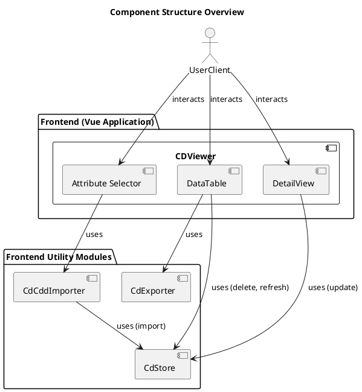

# CDViewer

```plantuml
skinparam style strictuml

' -----------------------
' Vue Component: CD Viewer
' -----------------------
class "CDViewer" <<Vue component>> {
  ..methods..
  handleColumnSelect()
  handleItemFocused()
  handleItemModified()
}
```

# DataTable

```plantuml
skinparam style strictuml

' -----------------------
' Vue Component: Data Table
' -----------------------
class "DataTable" <<Vue component>> {
  ..props..
  items : JSONArray
  selectedColumns : Array

  ..methods..
  loadItems()
  filterColumns()
  sortColumns()
  handleItemFocus()
  exportFocusedItem()
  deleteFocusedItem()

  ..watcher..
  selectedColumns
}
```

# CdExporter & CdStore

```plantuml
skinparam style strictuml
skinparam classAttributeIconSize 0

' -----------------------
' Typescript Module: Cd Exporter
' -----------------------
class "CdExporter" <<Typescript module>> {
  ..methods..
  +exportCdAsJSON(json)
}

' -----------------------
' Typescript Module: Cd Store
' -----------------------
class "CdStore" <<Typescript module>> {
  ..methods..
  +getConceptDescriptions(itemLimit, columnFilter, sortColumn)
  +createConceptDesctiption(cd)
  +updateConceptDescription(cd)
  +deleteConceptDescription(cd)
}
```

# AttributeSelector

```plantuml
skinparam style strictuml
skinparam classAttributeIconSize 0

' -----------------------
' Vue Component: Attribute Selector
' -----------------------
class "AttributeSelector" <<Vue component>> {
  ..props..
  selectedColumns : Array

  ..methods..
  columnSelectionCanged()
  itemImport()
  cloneRepo()
}
```

# DetailView

```plantuml
skinparam style strictuml
skinparam classAttributeIconSize 0

' -----------------------
' Vue Component: Detail View
' -----------------------
class "DetailView" <<Vue component>> {
  ..props..
  item : JSONObject

  ..methods..
  toggleEditMode()
  saveModifiedItem()
  discardChanges()

  ..watcher..
  item
}
```

# CdCddImporter

```plantuml
skinparam style strictuml
skinparam classAttributeIconSize 0

' -----------------------
' Typescript Module: CD CDD Importer
' -----------------------
class "CdCddImporter" <<Typescript module>> {
  ..methods..
  +importFromURI(uri)
  +importFromJSON(json)
  -importCD(cdUri)
  -importCDD(cddUri)
  -validateCD(cd)
  -validateCDD(cdd)
}
```

# Component Structure Overview

