# Software Requirement Specification (CRS) - BaSyx ConceptDescription-Plugin (CD-Manager)

## Versionskontrolle

| Version | Date       | Author | Comment                       |
| ------- | ---------- | ------ | ----------------------------- |
| 1.0     | 23.10.2025 | Niklas | Erste Version                 |
| 1.1     | 1.11.2025  | Niklas | Erweiterung und Bilder        |
| 2.0     | 10.05.2026 | Niklas | Anpassung der Spezifikationen |

## Inhaltsverzeichnis

<!-- TOC -->
* [Software Requirement Specification (CRS) - BaSyx ConceptDescription-Plugin (CD-Manager)](#software-requirement-specification-crs---basyx-conceptdescription-plugin-cd-manager)
  * [Versionskontrolle](#versionskontrolle)
  * [Inhaltsverzeichnis](#inhaltsverzeichnis)
  * [Einleitung](#einleitung)
    * [Zweck](#zweck)
    * [Produktumfang](#produktumfang)
    * [Definitionen und Abkürzungen](#definitionen-und-abkürzungen)
    * [Referenzen](#referenzen)
  * [Systemübersicht](#systemübersicht)
    * [Annahmen und Einschränkungen](#annahmen-und-einschränkungen)
  * [Funktionale Anforderungen (FR)](#funktionale-anforderungen-fr)
  * [FR-1 – CDs in Tabelle anzeigen sowie suchen und filtern](#fr-1--cds-in-tabelle-anzeigen-sowie-suchen-und-filtern)
    * [Beschreibung](#beschreibung)
    * [UI / Designvorstellung](#ui--designvorstellung)
    * [Ablauf](#ablauf)
      * [Erfolgsfall](#erfolgsfall)
      * [Fehlerfälle](#fehlerfälle)
    * [Ablaufdiagramm](#ablaufdiagramm)
    * [Referenzen](#referenzen-1)
  * [FR-2 - Interaktionen auf einzelnen CDs über Ineraktions-Menü](#fr-2---interaktionen-auf-einzelnen-cds-über-ineraktions-menü)
    * [Beschreibung](#beschreibung-1)
    * [UI / Designvorstellung](#ui--designvorstellung-1)
    * [Ablauf](#ablauf-1)
      * [Erfolgsfall](#erfolgsfall-1)
      * [Fehlerfälle](#fehlerfälle-1)
    * [Ablaufdiagramm](#ablaufdiagramm-1)
    * [Referenzen](#referenzen-2)
  * [FR-3 – Detail-Ansicht für CDs](#fr-3--detail-ansicht-für-cds)
    * [Beschreibung](#beschreibung-2)
    * [UI / Designvorstellung](#ui--designvorstellung-2)
    * [Ablauf](#ablauf-2)
      * [Erfolgsfall](#erfolgsfall-2)
      * [Fehlerfälle](#fehlerfälle-2)
    * [Ablaufdiagramm](#ablaufdiagramm-2)
    * [Referenzen](#referenzen-3)
  * [FR-4 – Editor-Ansicht für CDs](#fr-4--editor-ansicht-für-cds)
    * [Beschreibung](#beschreibung-3)
    * [UI / Designvorstellung](#ui--designvorstellung-3)
    * [Ablauf](#ablauf-3)
      * [Erfolgsfall](#erfolgsfall-3)
      * [Fehlerfälle](#fehlerfälle-3)
    * [Ablaufdiagramm](#ablaufdiagramm-3)
    * [Referenzen](#referenzen-4)
  * [FR-5 – Import Funktion für CDs über AASX](#fr-5--import-funktion-für-cds-über-aasx)
    * [Beschreibung](#beschreibung-4)
    * [UI / Designvorstellung](#ui--designvorstellung-4)
    * [Ablauf](#ablauf-4)
      * [Erfolgsfall](#erfolgsfall-4)
      * [Fehlerfälle](#fehlerfälle-4)
    * [Ablaufdiagramm](#ablaufdiagramm-4)
    * [Referenzen](#referenzen-5)
  * [FR-6 – Import Funktion für IECs als CD](#fr-6--import-funktion-für-iecs-als-cd)
    * [Beschreibung](#beschreibung-5)
    * [UI / Designvorstellung](#ui--designvorstellung-5)
    * [Ablauf](#ablauf-5)
      * [Erfolgsfall](#erfolgsfall-5)
      * [Fehlerfälle](#fehlerfälle-5)
    * [Ablaufdiagramm](#ablaufdiagramm-5)
    * [Referenzen](#referenzen-6)
  * [FR-7 – Export Funktion für CDs](#fr-7--export-funktion-für-cds)
    * [Beschreibung](#beschreibung-6)
    * [UI / Designvorstellung](#ui--designvorstellung-6)
    * [Ablauf](#ablauf-6)
      * [Erfolgsfall](#erfolgsfall-6)
      * [Fehlerfälle](#fehlerfälle-6)
    * [Ablaufdiagramm](#ablaufdiagramm-6)
    * [Referenzen](#referenzen-7)
  * [FR-8 – Referenzierung von CDs in SMs](#fr-8--referenzierung-von-cds-in-sms)
    * [Beschreibung](#beschreibung-7)
    * [UI / Designvorstellung](#ui--designvorstellung-7)
    * [Ablauf](#ablauf-7)
      * [Erfolgsfall](#erfolgsfall-7)
      * [Fehlerfälle](#fehlerfälle-7)
    * [Ablaufdiagramm](#ablaufdiagramm-7)
    * [Referenzen](#referenzen-8)
  * [FR-9 – Differenz- und Detailansicht für AASX CDs und IEC Import](#fr-9--differenz--und-detailansicht-für-aasx-cds-und-iec-import)
    * [Beschreibung](#beschreibung-8)
    * [UI / Designvorstellung](#ui--designvorstellung-8)
    * [Referenzen](#referenzen-9)
  * [FR-10 - Löschen einzelner CDs aus dem CD repository](#fr-10---löschen-einzelner-cds-aus-dem-cd-repository)
    * [Beschreibung](#beschreibung-9)
    * [UI / Designvorstellung](#ui--designvorstellung-9)
    * [Ablauf](#ablauf-8)
      * [Erfolgsfall](#erfolgsfall-8)
      * [Fehlerfälle](#fehlerfälle-8)
    * [Ablaufdiagramm](#ablaufdiagramm-8)
    * [Referenzen](#referenzen-10)
  * [FR-11 - CDs über JSON Datei importieren](#fr-11---cds-über-json-datei-importieren)
    * [Beschreibung](#beschreibung-10)
    * [UI / Designvorstellung](#ui--designvorstellung-10)
    * [Ablauf](#ablauf-9)
      * [Erfolgsfall](#erfolgsfall-9)
      * [Fehlerfälle](#fehlerfälle-9)
    * [Ablaufdiagramm](#ablaufdiagramm-9)
    * [Referenzen](#referenzen-11)
  * [Nichtfunktionale Anforderungen (NFR)](#nichtfunktionale-anforderungen-nfr)
  * [NFR-1 - Nutzerfreundlichkeit](#nfr-1---nutzerfreundlichkeit)
    * [Beschreibung](#beschreibung-11)
  * [NFR-2 - Responsive Design](#nfr-2---responsive-design)
    * [Beschreibung](#beschreibung-12)
  * [NFR-3 - Wartbarkeit](#nfr-3---wartbarkeit)
    * [Beschreibung](#beschreibung-13)
<!-- TOC -->

## Einleitung

### Zweck

Dieses Dokument beschreibt die Anforderungen an den zu implementierenden CD-Manager.
Im Fokus steht hierbei die klare definition des Verhaltens und Funktion
aller [Nutzeranforderungen](../CRS/TINF24F_1-CRS-6v0.md#nutzeranforderungen),
die in
der [Customer Requirement Specification](../CRS/TINF24F_1-CRS-6v0.md#customer-requirement-specification-crs---basyx-conceptdescription-plugincd-manager)
beschrieben werden.

### Produktumfang

Es soll ein Plugin für die bestehende BaSyx-Web-UI erstellt werden mit dem Concept Descriptions angezeigt, durchsucht,
bearbeitet, importiert und gelöscht werden können.
Dies soll Nutzern der Web UI ermöglichen, Concept Descriptions über eine grafische Oberfläche zu verwalten und so Asset
Administration Shells zu Warten.
Hierfür stellt BaSyx bereits ein vollständiges Backend bereit, welches durch die bestehende UI jedoch nicht genutzt
werden kann.

### Definitionen und Abkürzungen

| Begriff | Beschreibung                              |
| ------- | ----------------------------------------- |
| CRS     | Customer Requirement Specification        |
| SAS     | Software Architecture Specification       |
| AAS     | Asset Administration Shell                |
| SM      | Submodel                                  |
| CD      | Concept Description                       |
| ID      | Identifier                                |
| IRDI    | International Regitration Data Identifier |
| IEC     | International Electrotechnical Comission  |
| CDD     | Common Data Dictionary                    |
| AASX    | Asset Administration Shell Dateiformat    |

### Referenzen

- [CRS Dokument](../CRS/TINF24F_1-CRS-6v0.md)
- SAS Dokument

---

## Systemübersicht

### Annahmen und Einschränkungen

- Der CD-Manager ist vollständig in die Web UI zu integrieren
- Das bestehende Backend ist im Verlaufe des Projekts nicht zu verändern
- Funktionalitäten müssen durch den AAS-Standard unterstützt sein
- Funktionalitäten, die nicht dem AAS-Standard entspringen dürfen keinen Einfluss außerhalb der CD-Manager
  Funktionalität haben

---

## Funktionale Anforderungen (FR)

---

## FR-1 – CDs in Tabelle anzeigen sowie suchen und filtern

### Beschreibung

Das System soll eine Tabellenansicht bereitstellen, in der CDs angezeigt werden.
Die Tabellenansicht soll eine Seitenaufteilung (Pagination) unterstützen, damit große Datenmengen übersichtlich
dargestellt werden können.

Nutzer sollen CDs anhand definierter Kriterien suchen und filtern können.
Die Such- und Filterergebnisse sollen direkt innerhalb der Tabelle angezeigt werden.

Die Tabellenansicht soll mindestens folgende Informationen pro CD darstellen:

- ID/IRDI
- ID short
- Unit/Einheit
- Definition (dies kann für eine Tabellen ansicht zu lang werden)

### UI / Designvorstellung

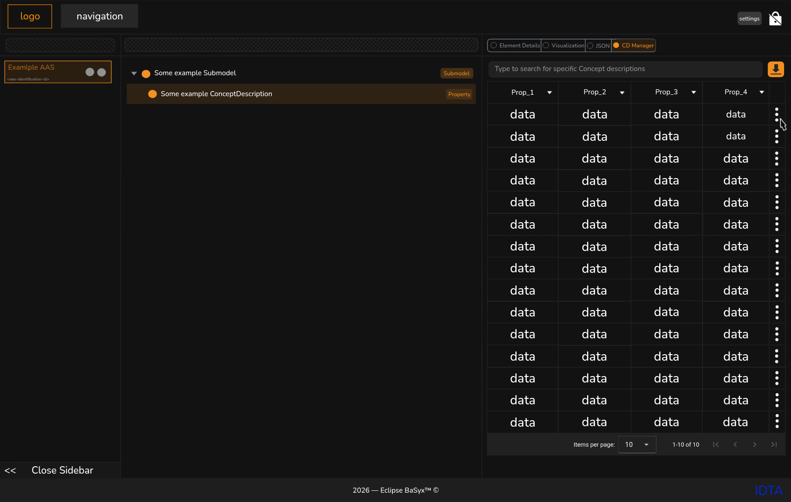

### Ablauf

#### Erfolgsfall

1. Nutzer öffnet den CD-Manager
2. System lädt die erste Seite der Tabelle
3. Nutzer gibt einen Suchbegrif oder Filter ein
4. System filtert die Datensätze
5. Tabelle wird aktualisiert
6. Nutzer navigiert zwischen den seiten

#### Fehlerfälle

- Keine CDs werden gefunden
- Ungültige Filter werden angegeben
- Daten konnten nicht geladen werden

### Ablaufdiagramm

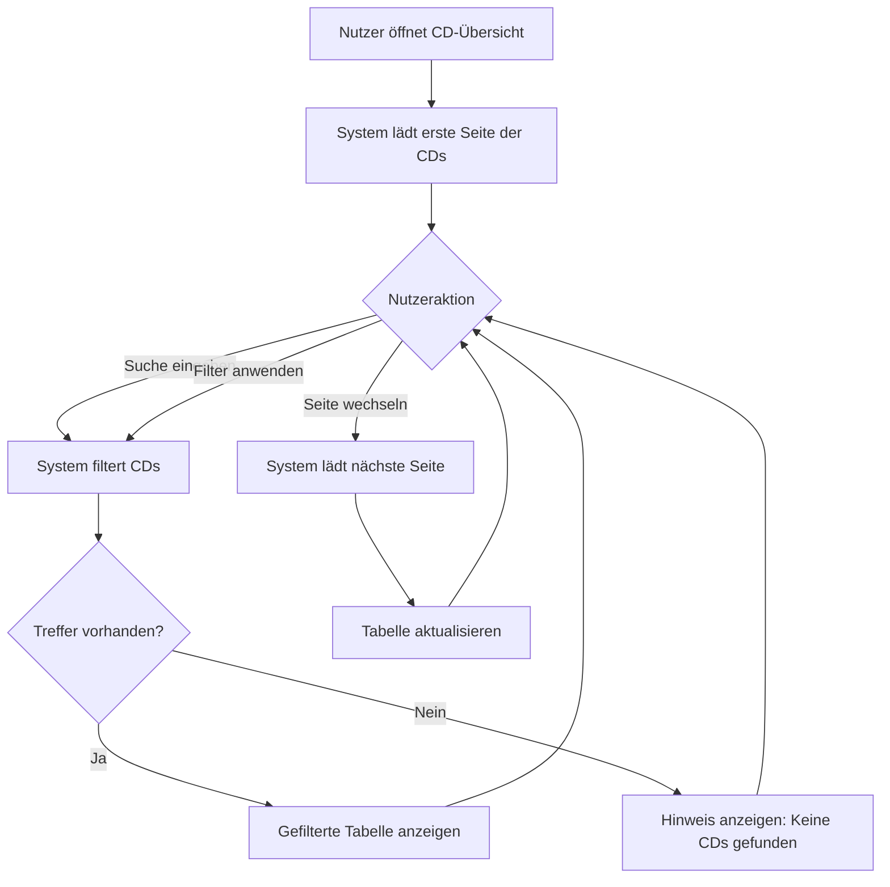
```mermaid
flowchart TD
    A[Nutzer öffnet CD-Übersicht] --> B[System lädt erste Seite der CDs]
    B --> C{Nutzeraktion}
    C -->|Suche eingeben| D[System filtert CDs]
    C -->|Filter anwenden| D
    C -->|Seite wechseln| E[System lädt nächste Seite]
    D --> F{Treffer vorhanden?}
    F -->|Ja| G[Gefilterte Tabelle anzeigen]
    F -->|Nein| H[Hinweis anzeigen: Keine CDs gefunden]
    G --> C
    H --> C
    E --> I[Tabelle aktualisieren]
    I --> C
```

### Referenzen

- [UC-1](../CRS/TINF24F_1-CRS-6v0.md#uc-1-cds-in-tabelle-und-tabellenseiten-auflisten-und-suchenfiltern): CDs in Tabelle
  und Tabellenseiten auflisten und suchen/filtern

## FR-2 - Interaktionen auf einzelnen CDs über Ineraktions-Menü

### Beschreibung

Das System soll Nutzern ermöglichen, über ein Interaktions-Menü mit einzelnen CDs innerhalb der Tabellenansicht zu
interagieren.

Jede Tabellenzeile soll ein Drei-Punkte-Menü bereitstellen.
Über dieses Menü sollen folgende Aktionen verfügbar sein:

- Öffnen der Detailsicht
- Öffnen der Editoransicht
- Referenzierung oder Dereferenzierung in SMs
- Export der CD als JSON-Datei
- Löschen der CD

Die Aktionen sollen abhängig von aktuellen Zustand der CD angezeigt werden.
Ist eine CD bereits in dem ausgewählten SM referenziert, so soll die Aktion "Derefernzieren" angeboten werden,
andernfalls "Referenzieren".

### UI / Designvorstellung

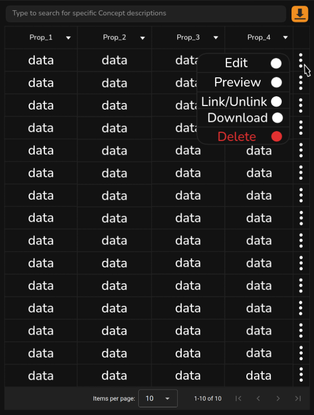

### Ablauf

#### Erfolgsfall

1. Nutzer öffnet die Tabellenansicht
2. Nutzer öffnet das Drei-Punkte-Menü einer CD
3. System zeigt verfügbare Aktionen an
4. Nutzer wählt eine Aktion aus
5. System führt die gewählte Aktion aus
6. Nutzer erhält eine Rückmeldung oder wird auf eine ander Ansicht weitergeleitet

#### Fehlerfälle

- Aktion konnte nicht durchgeführt werden
- CD existiert nicht mehr
- Nutzer besitzt keine Berechtigung

### Ablaufdiagramm

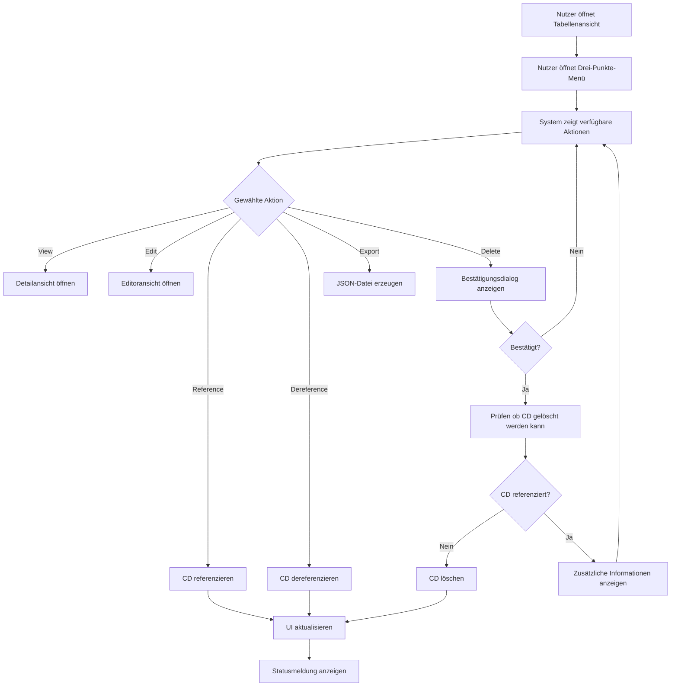
```mermaid
flowchart TD
    A[Nutzer öffnet Tabellenansicht] --> B[Nutzer öffnet Drei-Punkte-Menü]
    B --> C[System zeigt verfügbare Aktionen]
    C --> D{Gewählte Aktion}
    D -->|View| E[Detailansicht öffnen]
    D -->|Edit| F[Editoransicht öffnen]
    D -->|Reference| G[CD referenzieren]
    D -->|Dereference| H[CD dereferenzieren]
    D -->|Export| I[JSON-Datei erzeugen]
    D -->|Delete| J[Bestätigungsdialog anzeigen]
    J --> K{Bestätigt?}
    K -->|Nein| C
    K -->|Ja| L[Prüfen ob CD gelöscht werden kann]
    L --> M{CD referenziert?}
    M -->|Nein| O[CD löschen]
    M -->|Ja| N[Zusätzliche Informationen anzeigen]
    O --> P[UI aktualisieren]
    G --> P
    H --> P
    P --> Q[Statusmeldung anzeigen]
    N --> C
```

### Referenzen

- [UC-2](../CRS/TINF24F_1-CRS-6v0.md#uc-2-tabellen-interaktionen-auf-einzelnen-cds): Tabellen-interaktionen auf
  einzelnen CDs

## FR-3 – Detail-Ansicht für CDs

### Beschreibung

Das System soll eine Detailansicht für CDs bereitstellen.
Nutzer sollen dadurch vollständige Informationen zu einer einzelnen CD einsehen können.

Die Detailansicht sol insbesondere die eindeutige Identifikation einer CD ermöglichen, auch wenn mehrere CDs ähnliche
Bezeichnungen oder fachliche Bedeutungen besitzen.

Die Ansicht soll alle Daten der CD übersichtlich darstellen.

### UI / Designvorstellung

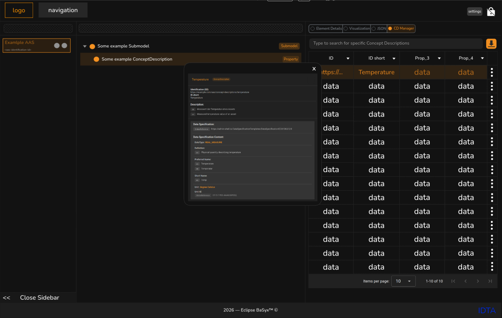

### Ablauf

#### Erfolgsfall

1. Nutzer öffnet das Interaktions-Menü einer CD
2. Nutzer wählt Aktion "View"
3. System öffnet die Detailansicht
4. Nutzer betrachtet die Informationen

#### Fehlerfälle

keine

### Ablaufdiagramm

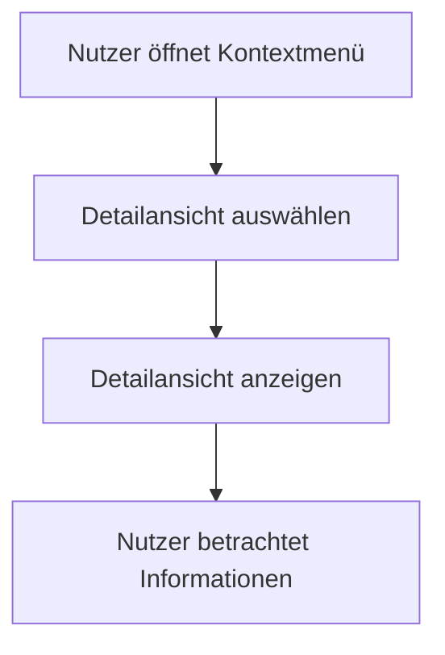
```mermaid
flowchart TD
    A[Nutzer öffnet Kontextmenü] --> B[Detailansicht auswählen]
    B --> C[System lädt CD-Daten]
    C[Detailansicht anzeigen]
    C --> D[Nutzer betrachtet Informationen]
```

### Referenzen

- [UC-3](../CRS/TINF24F_1-CRS-6v0.md#uc-3-detail-ansicht-für-cds): Detail-Ansicht für CDs

## FR-4 – Editor-Ansicht für CDs

### Beschreibung

Das System soll eine Editoransicht für CDs bereitstellen.
Nutzer sollen bestehende CDs öffnen, bearbeiten und speichern können.

Die Editoransicht soll sicherstellen, dass CDs nicht in einen ungültigen Zustand vesetzt werden können.
Während dem Hinzufügen und Editieren der Datenfelder, sollen Eingaben validiert werden.

Ungültige oder unvollständige Daten dürfen nicht gespeichert werden.

Nicht editierbare Datenfelder sollen schreibgeschützt dargestellt werden.

### UI / Designvorstellung

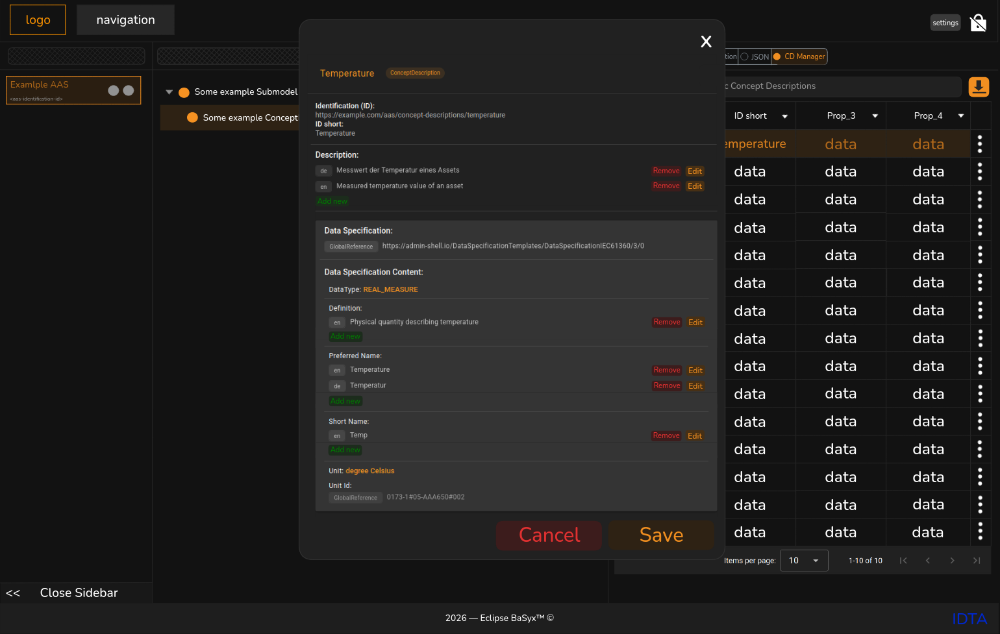

### Ablauf

#### Erfolgsfall

1. Nutzer öffnet das Interaktions-Menü einer CD
2. Nutzer wählt Aktion "Edit"
3. System öffnet die CD in der Editoransicht
4. Nutzer bearbeitet Datenfelder
5. System Validiert "on the go" die Eingaben des nutzers
6. Nutzer speichert alle gemachten Änderungen am Ende

#### Fehlerfälle

- Validierung markiert Eingabe als ungültig
- Update der CD nicht möglich, da sie zwischen Laden und Update gelöscht wurde
- Update der CD überschreibt Änderung eines anderen Nutzers auf der gleichen CD

### Ablaufdiagramm

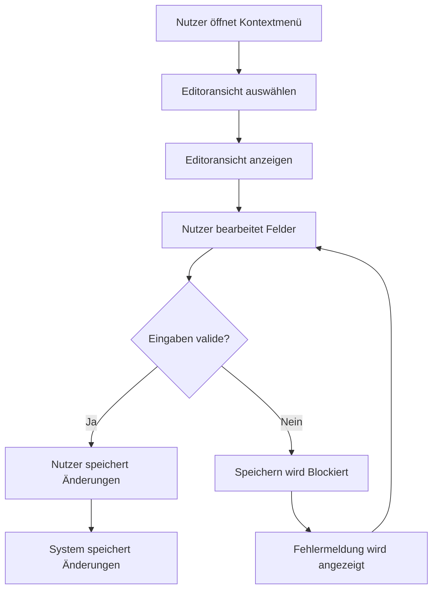
```mermaid
flowchart TD
    A[Nutzer öffnet Kontextmenü] --> B[Editoransicht auswählen]
    B --> C[Editoransicht anzeigen]
    C --> D[Nutzer bearbeitet Felder]
    D --> E{Eingaben valide?}
    E -->|Ja| F[Nutzer speichert Änderungen]
    F --> G[System speichert Änderungen]
    E -->|Nein| H[Speichern wird Blockiert]
    H --> I[Fehlermeldung wird angezeigt]
    I --> D
```

### Referenzen

- [UC-4](../CRS/TINF24F_1-CRS-6v0.md#uc-4-editor-ansicht-für-cds): Editor-Ansicht für CDs

## FR-5 – Import Funktion für CDs über AASX

### Beschreibung

Das System soll Nutzern ermöglichen, AASX-Dateien hochzuladen und daraus enthaltene Cds zu extrahieren.

Nach dem Upload soll das System die Datei analysieren und ausschließlich die enthaltenen CDs importieren.
Nicht relevante Inhalte der AASX-Datei, sprich alles was keine CD ist, sollen ignoriert werden.

Gefundene CDs sollen selektiv impoortierbar sein, und mit einem Status versehen werden, der indiziert, ob die CD schon
existiert oder nicht.
Für existierende CDs soll es eine Differenzanzeige geben, damit Nutzer entscheiden können, ob sie die existierende CD
überschreiben wollen.
Alle CDs können zudem vor dem Import über die [Detailansicht](#fr-3--detail-ansicht-für-cds) betrachtet werden.

### UI / Designvorstellung

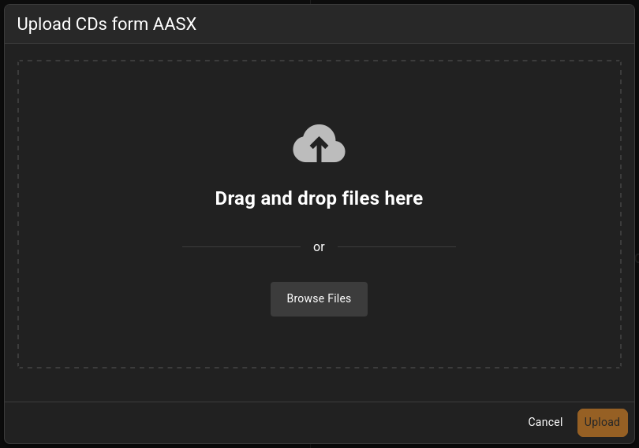

### Ablauf

#### Erfolgsfall

1. Nutzer öffnet die Importansicht
2. Nutzer wählt eine AASX-Datei aus
3. Nutzer startet den Scan nach CDs
4. System sucht alle CDs und bereitet sie ggf. für den Import auf
5. System zeigt gefundene CDs an
6. Nutzer wählt zu importierende CDs aus
7. Nutzer startet manuell den Import
8. Nutzer erhält eine Zusammenfassung der Importierten CDs

#### Fehlerfälle

- Datei ist in ungültigem Format
- Es existieren keine CDs in AASX-Datei
- CDs sind fehlerhaft in der AASX-Datei vorhanden

### Ablaufdiagramm

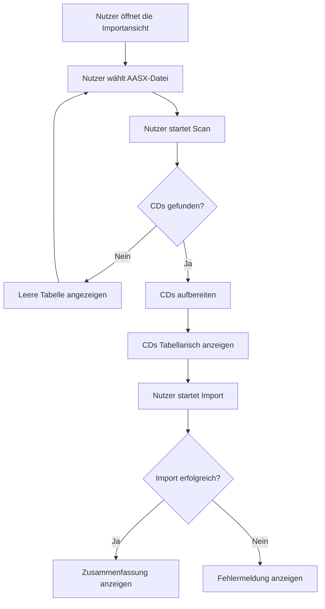
```mermaid
flowchart TD
    A[Nutzer öffnet die Importansicht] --> B[Nutzer wählt AASX-Datei]
    B --> C[Nutzer startet Scan]
    C --> D{CDs gefunden?}
    D -->|Nein| E[Leere Tabelle angezeigen]
    E --> B
    D -->|Ja| F[CDs aufbereiten]
    F --> G[CDs Tabellarisch anzeigen]
    G --> H[Nutzer startet Import]
    H --> I{Import erfolgreich?}
    I -->|Ja| J[Zusammenfassung anzeigen]
    I -->|Nein| K[Fehlermeldung anzeigen]
```

### Referenzen

- [UC-5](../CRS/TINF24F_1-CRS-6v0.md#uc-5-import-funktion-für-cd-über-aasx): Import Funktion für CDs über AASX
- [FR-9](#fr-9--differenz--und-detailansicht-für-aasx-cd-import): Differenz- und Detailansicht für AASX CD Import

## FR-6 – Import Funktion für IECs als CD

### Beschreibung

Das System soll Nutzern ermöglichen, IEC-Datensätze aus dem CDD hochzuladen und als CD zu importieren.

Die hochgeladenen IEC-Datensätze sollen analysiert und in ein CD-kompatibles Format geparsed werden.
Invalide Datensätze sollen ignoriert werden.

### UI / Designvorstellung

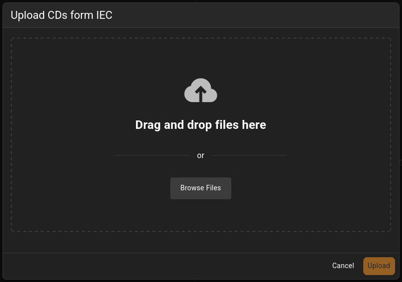

### Ablauf

#### Erfolgsfall

1. Nutzer öffnet die IEC-Importansicht
2. Nutzer wählt eine IEC-Datei aus
3. Nutzer startet Scan- und Parseprozess
4. System zeigt erfolgreich gefundene und geparste Datensätze tabellarisch an
5. Nutzer startet Import
6. System importiert Datensatz

#### Fehlerfälle

- Datei ist in ungültigem Fromat
- IEC-Datensatz ist nicht in erwartetem Format in der Datei
- IEC-Datensatz ist unvollständig/ungültig

### Ablaufdiagramm

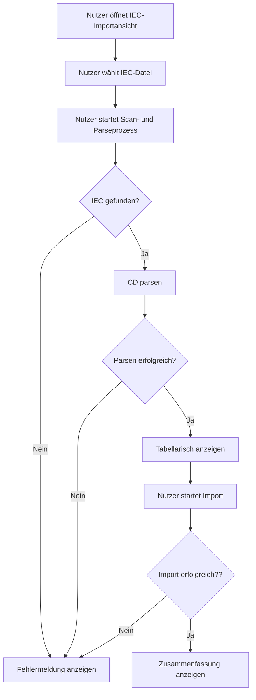
```mermaid
flowchart TD
    A[Nutzer öffnet IEC-Importansicht] --> B[Nutzer wählt IEC-Datei]
    B --> C[Nutzer startet Scan- und Parseprozess]
    C --> D{IEC gefunden?}
    D -->|Ja| E[CD parsen]
    D -->|Nein| F[Fehlermeldung anzeigen]
    E --> G{Parsen erfolgreich?}
    G -->|Nein| F
    G -->|Ja| H[Tabellarisch anzeigen]
    H --> I[Nutzer startet Import]
    I --> J{Import erfolgreich??}
    J -->|Ja| K[Zusammenfassung anzeigen]
    J -->|Nein| F
```

### Referenzen

- [UC-6](../CRS/TINF24F_1-CRS-6v0.md#uc-6-import-funktion-für-iecs-als-cd): Import Funktion für IECs als CD
- [NFR-1](#nfr-1--differenz--und-detailansicht-für-aasx-cd-import): Differenz- und Detailansicht für AASX CD Import

## FR-7 – Export Funktion für CDs

### Beschreibung

Das System soll Nutzern ermöglichen, eine CD als JSON-Datei zu exportieren.

Der Export soll die vollständige CD in ein standartisiertes JSON-Format überführen.

### UI / Designvorstellung

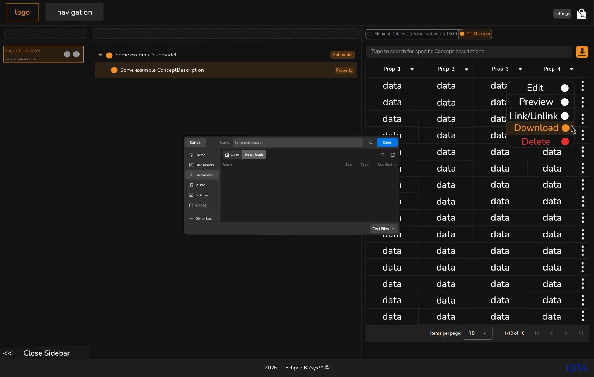

### Ablauf

#### Erfolgsfall

1. Nutzer wählt eine CD für export aus
2. System erzeugt JSON Datei mit CD Daten
3. Nutzer wählt Ablageordner und Dateiname aus
4. Nutzer bestätigt Ablageordner und Dateiname

#### Fehlerfälle

- Export wurde abgebrochen

### Ablaufdiagramm

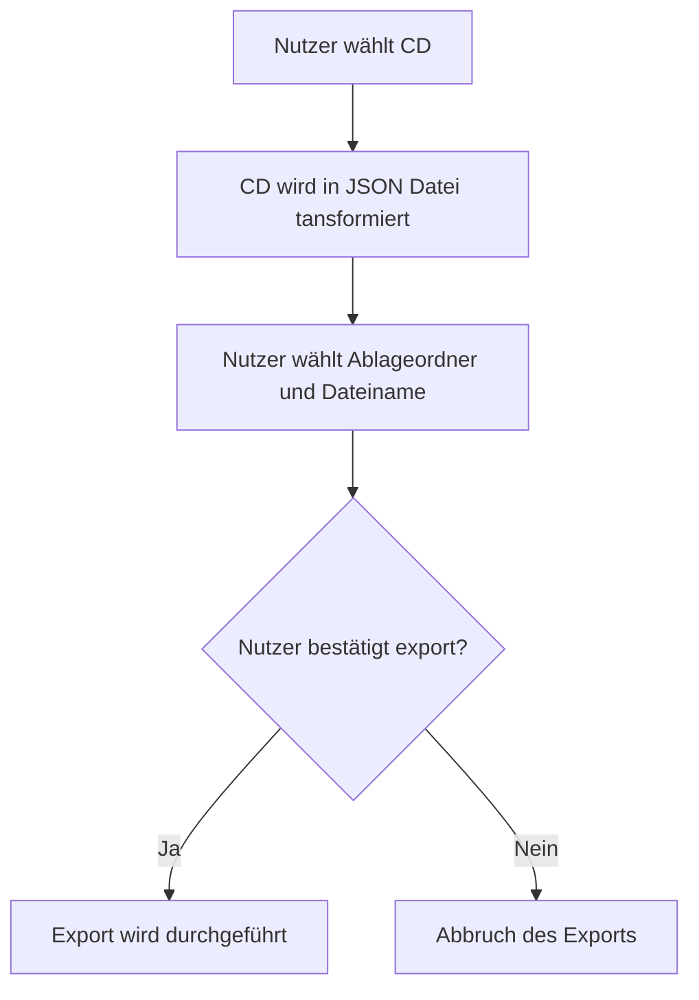
```mermaid
flowchart TD
    A[Nutzer wählt CD] --> B[CD wird in JSON Datei tansformiert]
    B --> C[Nutzer wählt Ablageordner und Dateiname]
    C --> D{Nutzer bestätigt export?}
    D -->|Ja| E[Export wird durchgeführt]
    D -->|Nein| F[Abbruch des Exports]
```

### Referenzen

- [UC-7](../CRS/TINF24F_1-CRS-6v0.md#uc-7-export-funktion-für-cds): Export Funktion für CDs

## FR-8 – Referenzierung von CDs in SMs

### Beschreibung

Das System soll Nutzern ermöglichen, CDs in SMs zu referenzieren, sowie bestehende Referenzen zu entfernen.

Eine Referenz stellt eine logische Verknüpfung zwischen einer CD und einem SM dar, ohne die CD selbst zu verändern.

Die Auswahl der CD findet über die Tabellenansicht statt, wobei die Wahl des SMs über die Baumansicht, links zur
Tabellenansicht, geschieht.
Beim auswählen der Aktion "Reference" oder "Dereference" wird ein Pop-up geöffnet, das nochmals die CD und das
betreffende SM anzeigt.

Durch die Bestätigung des Nutzers wird die Aktion ausgeführt.

### UI / Designvorstellung

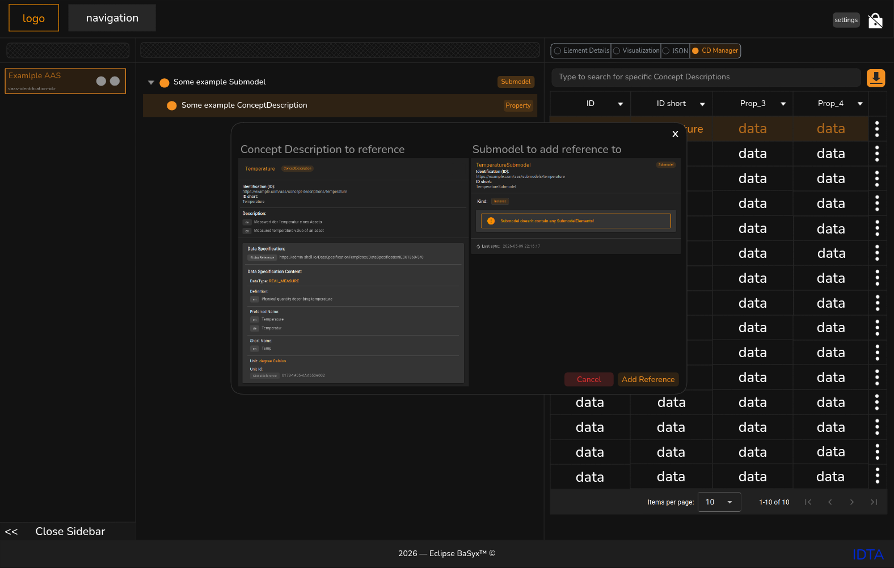

### Ablauf

#### Erfolgsfall

1. Nutzer wählt ein SM in der Baumansicht aus
2. Nutzer wählt Aktion "Reference" oder "Dereference"
3. Pop-up wird geöffnet und zeigt CD und SM an
4. Nutzer bestätigt oder bricht Aktion ab

#### Fehlerfälle

- SM Existiert nicht mehr
- CD Existiert nicht mehr
- Nutzer bricht Aktion ab

### Ablaufdiagramm

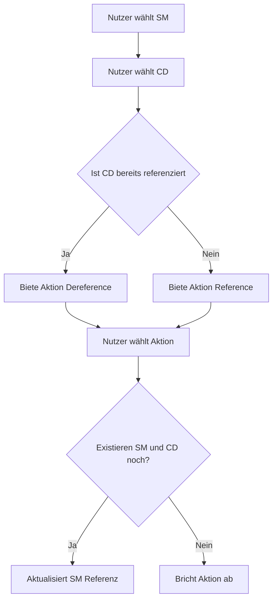
```mermaid
flowchart TD
    A[Nutzer wählt SM] --> B[Nutzer wählt CD]
    B --> C{Ist CD bereits referenziert}
    C -->|Ja| D[Biete Aktion Dereference]
    C -->|Nein| E[Biete Aktion Reference]
    D --> F[Nutzer wählt Aktion]
    E --> F
    F --> G{Existieren SM und CD noch?}
    G -->|Ja| H[Aktualisiert SM Referenz]
    G -->|Nein| I[Bricht Aktion ab]
```

### Referenzen

- [UC-8](../CRS/TINF24F_1-CRS-6v0.md#uc-8-referenzierung-von-cds-in-submodellen): Referenzierung von CDs in Submodellen

## FR-9 – Differenz- und Detailansicht für AASX CDs und IEC Import

### Beschreibung

Das System soll den Importprozess für CDs transparent und kontrollierbar gestalten.

Nach der Analyse einer AASX-Datei oder eines IEC-Datensatzes, sollen gefundene CDs vor dem eigentlichen Import angezeigt
werden.
Nutzer sollen einzelne CDs selektiv für den Import auswählen oder abwählen können.

Für jede gefundene CD soll ein Importstatus angezeigt werden.
So kann der Nutzer neue CDs von bereits existierenden unterscheiden.

Existiert eine CD bereits im System, soll eine Differenzanzeige geöffnet werden können, sodass der Nutzer entscheiden
kann, ob die existierende CD überschrieben werden soll oder nicht.

Alle gefundenen CDs sollen zusätzlich selektiv über eine Detailansicht einsehbar sein.

### UI / Designvorstellung

Momentan kein wireframe vorhanden

### Referenzen

- [UC-5](../CRS/TINF24F_1-CRS-6v0.md#uc-5-import-funktion-für-cd-über-aasx): Import Funktion für CD über AASX
- [FR-5](#fr-5--import-funktion-für-cds-über-aasx): Import Funktion für CDs über AASX
- [UC-6](../CRS/TINF24F_1-CRS-6v0.md#uc-6-import-funktion-für-iecs-als-cd): Import Funktion für IECs als CD
- [FR-6](#fr-6--import-funktion-für-iecs-als-cd): Import Funktion für IECs als C

## FR-10 - Löschen einzelner CDs aus dem CD repository

### Beschreibung

Das System soll Nutzern ermöglichen, CDs aus dem CD repository zu löschen.

Der Nutzer soll, bevor die CD gelöscht wird, auf eine Ansicht kommen, in der nochmals die CD angezeigt wird.
Wenn die gewählte CD noch referenziert wird, soll der Nutzer über eine Warnung informiert werden, dass dieses CD noch von SMs referenziert wird.

Das Löschen soll in diesem Fall über einen weiteren Schritt möglich sein, bei dem der Nutzer aufgefordert wird, die referenzen explizit zu löschen.
Dieser Vorgang soll nicht ausversehen geschehen können, entsprechend soll es nicht möglich sein stumpf "bestätigen" zu klicken.

Empfohlen wird eine Text Eingabe, mit der der Nutzer einen prägnanten Satz schreiben muss, um die Referenzen automatisch zu entfernen.

### UI / Designvorstellung

### Ablauf

#### Erfolgsfall

**Erfolgsfall eines verwaisten CDs:**

1. Nutzer wählt eine CD zum löschen aus
2. Nutzer wählt Aktion "Delete"
3. Pop-up wird geöffnet und zeigt CD an
4. Nutzer bestätigt oder bricht Aktion ab

**Erfolgsfall eines referenzierten CDs:**

1. Nutzer wählt eine CD zum löschen aus
2. Nutzer wählt Aktion "Delete"
3. Pop-up wird geöffnet und zeigt CD sowie eine Warnung an
4. Nutzer bekommt eine Liste an SMs, die das CD noch referenzieren
5. Nutzer bricht ab oder gibt Bestätigungstext ein
6. Nutzer klickt bestätigen
7. Referenzen werden gelöscht
8. Nutzer bestätigt oder bricht löschen Aktion für CD ab

#### Fehlerfälle

- Referenzen können nicht gelöscht werden
- CD Existiert nicht mehr
- Nutzer bricht Aktion ab

### Ablaufdiagramm

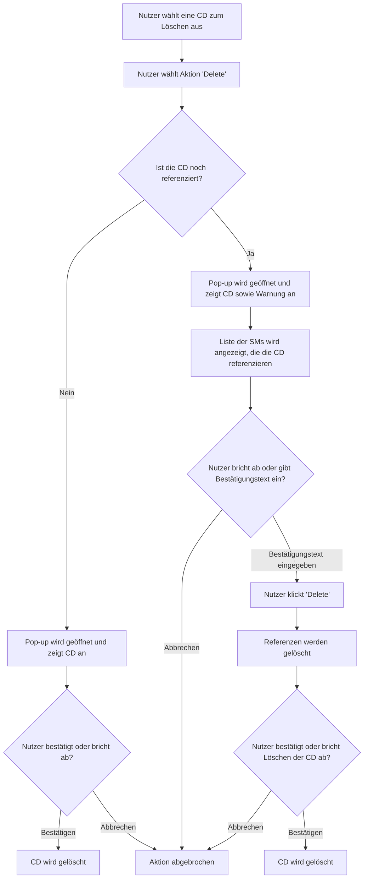
```mermaid
flowchart TD

  A[ Nutzer wählt eine CD zum Löschen aus ]
  B[ Nutzer wählt Aktion 'Delete' ]
C{ Ist die CD noch referenziert? }

%% Verwaiste CD
D[ Pop-up wird geöffnet und zeigt CD an ]
E{ Nutzer bestätigt oder bricht ab? }
F[ CD wird gelöscht ]
G[ Aktion abgebrochen ]

%% Referenzierte CD
H[ Pop-up wird geöffnet und zeigt CD sowie Warnung an ]
I[ Liste der SMs wird angezeigt, die die CD referenzieren ]
J{ Nutzer bricht ab oder gibt Bestätigungstext ein? }
L[ Nutzer klickt 'Delete' ]
M[ Referenzen werden gelöscht ]
N{ Nutzer bestätigt oder bricht Löschen der CD ab? }
O[ CD wird gelöscht ]

%% Flow
A --> B --> C

C -- Nein --> D --> E
E -- Bestätigen --> F
E -- Abbrechen --> G

C -- Ja --> H --> I --> J
J -- Abbrechen --> G
J -- Bestätigungstext eingegeben --> L --> M --> N
N -- Bestätigen --> O
N -- Abbrechen --> G
```

### Referenzen

- [UC-9](../CRS/TINF24F_1-CRS-6v0.md#uc-9-l%C3%B6schen-einzelner-cds-aus-dem-cd-repository): Löschen einzelner CDs aus dem CD repository

## FR-11 - CDs über JSON Datei importieren

### Beschreibung

Das System soll Nutzern ermöglichen, CDs zu importieren, welche im JSON Format vorhanden sind.

Die JSON datei muss in dem BaSyx kompatiblen format vorliegen und soll vor dem Import nochmals auf Richtigkeit geprüft werden.
Ein fehlgeschlagener import gibt eine Fehlermeldung zurück.
Erfolgreiche imports erstellen ein CD in dem CD repository an.

### UI / Designvorstellung

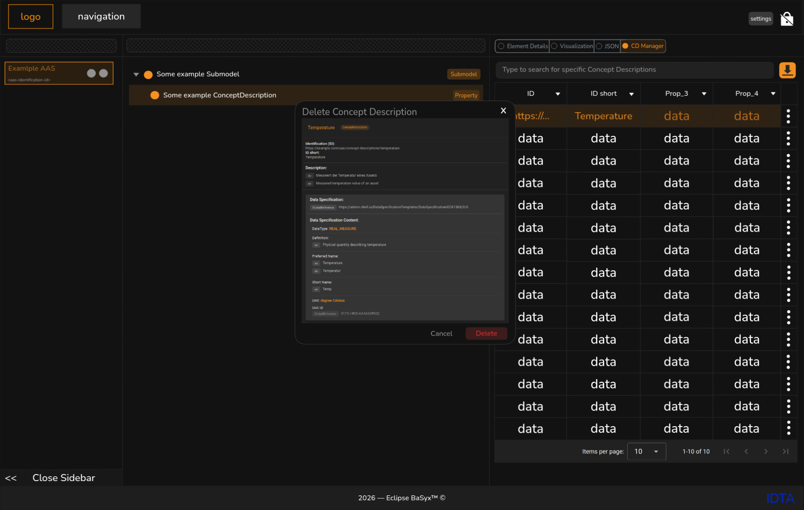

### Ablauf

#### Erfolgsfall

1. Nutzer wählt die Import option aus
2. System öffnet den Dateimanager
3. Der Nutzer wählt eine JSON Datei aus
4. Nutzer bestätigt oder bricht Aktion ab

#### Fehlerfälle

- JSON Datei enthält keine valide CD
- CD mit der ID existiert schon

### Ablaufdiagramm

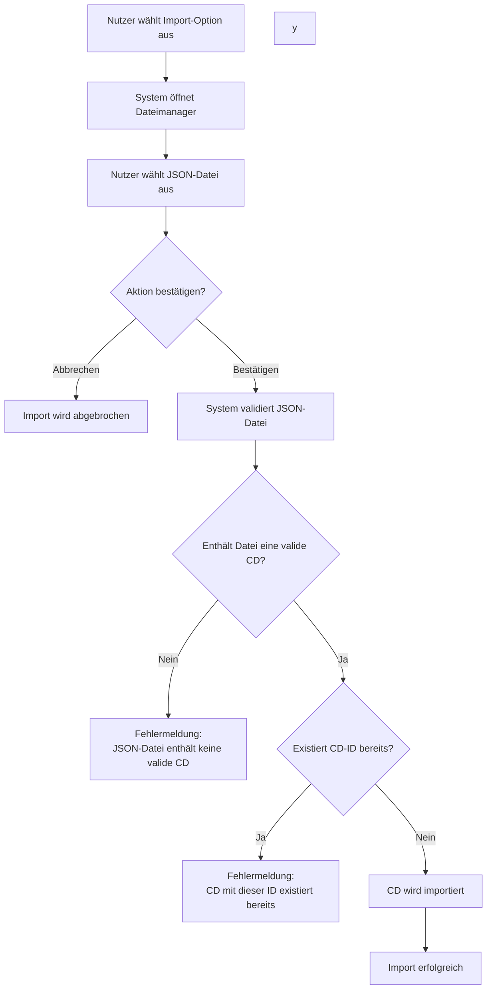
```mermaid
flowchart TD
    A[Nutzer wählt Import-Option aus] --> B[System öffnet Dateimanager]
    B --> C[Nutzer wählt JSON-Datei aus]
y
    C --> D{Aktion bestätigen?}

    D -->|Abbrechen| E[Import wird abgebrochen]

    D -->|Bestätigen| F[System validiert JSON-Datei]

    F --> G{Enthält Datei eine valide CD?}

    G -->|Nein| H[Fehlermeldung:<br/>JSON-Datei enthält keine valide CD]

    G -->|Ja| I{Existiert CD-ID bereits?}

    I -->|Ja| J[Fehlermeldung:<br/>CD mit dieser ID existiert bereits]

    I -->|Nein| K[CD wird importiert]

    K --> L[Import erfolgreich]
```

### Referenzen

- [UC-10](../CRS/TINF24F_1-CRS-6v0.md#uc-10-cds-über-json-datei-importieren): CDs über JSON Datei importieren

---

## Nichtfunktionale Anforderungen (NFR)

---

## NFR-1 - Nutzerfreundlichkeit

### Beschreibung

Die Nutzeroberfläche sollte sich an bereits existierendem UI-Design innerhalb der Applikation, sowie gängigen Design-Prinzipien orientieren. Die Bedienung für neue Nutzer soll dadurch so einfach und intuitiv wie möglich gehalten werden.

## NFR-2 - Responsive Design

### Beschreibung

Die Nutzeroberfläche sollte sich problemlos an alle üblichen Querformat-Bildschirmauflösungen anpassen.

## NFR-3 - Wartbarkeit

### Beschreibung

Der Code sollte einfach verständlich sein und sich an bereits im Projekt etablierte Code-Conventions halten. Die Wartung, Anpassung und Erweiterung der entwickelten Features sollte so einfach wie möglich sein.