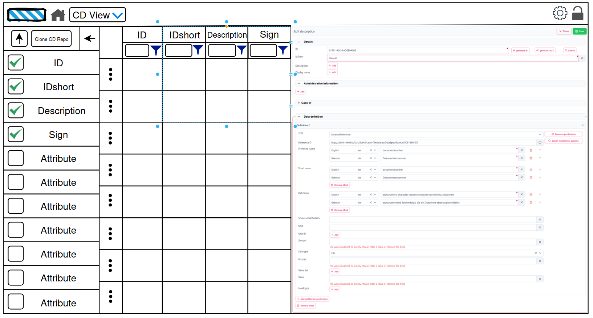
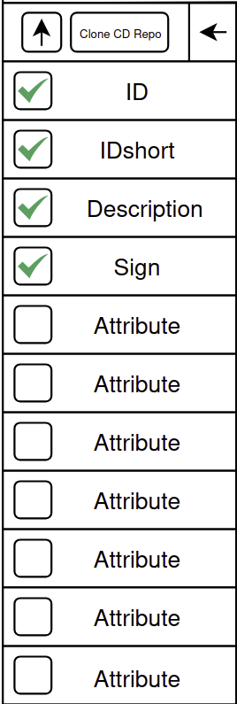
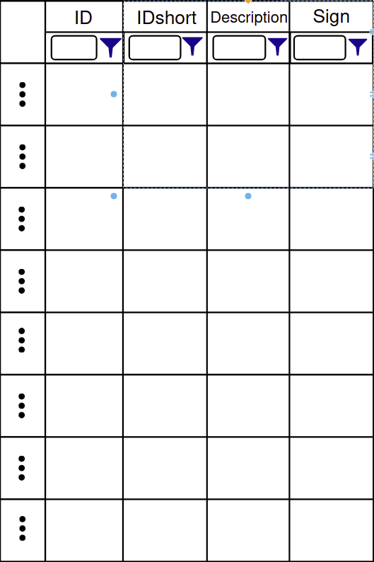
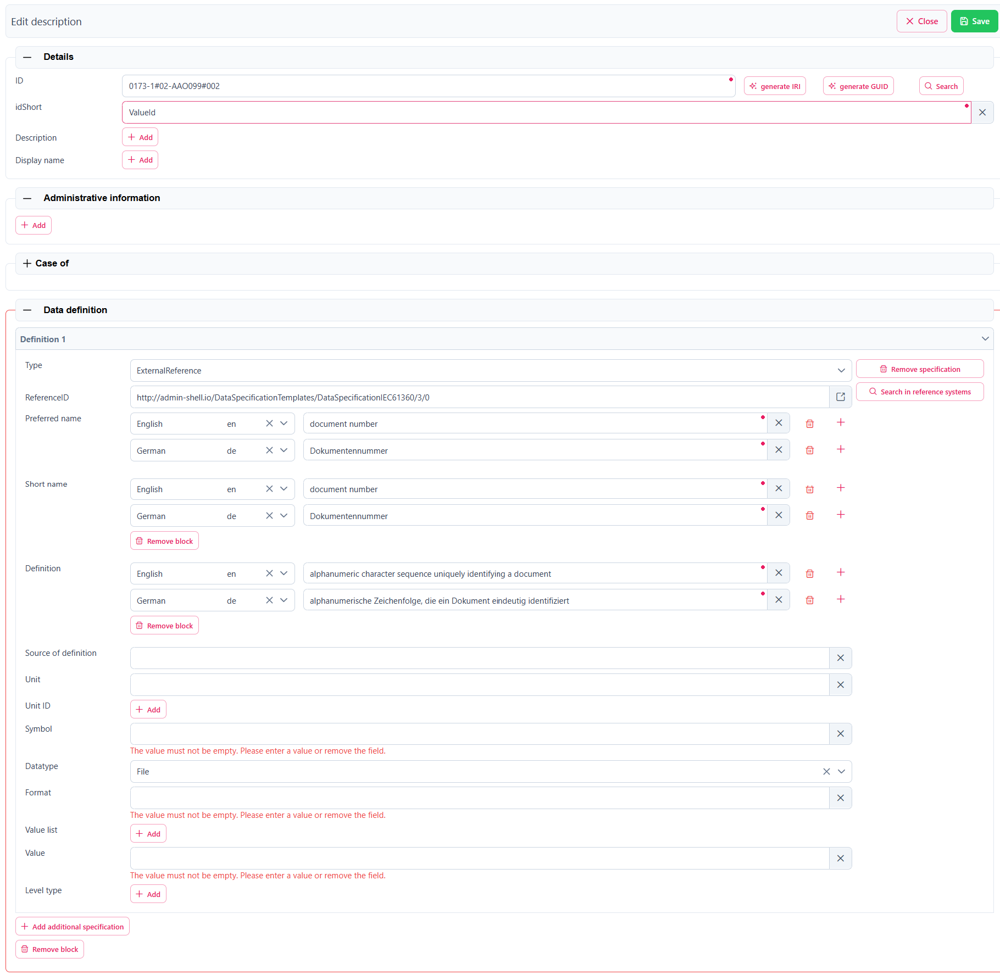
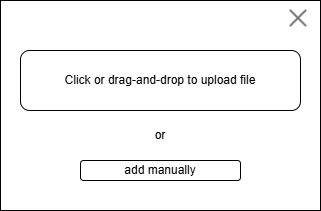
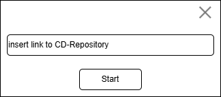

# Pflichtenheft - BaSyx ConceptDescription-Plugin (CD-Manager)

## Version Control

| Version | Date       | Author | Comment        |
| ------- | ---------- | ------ | -------------- |
| 1.0     | 23.10.2025 | Niklas | Erste Version  |
| 1.1     |  1.11.2025 | Niklas | Erweiterung und Bilder |

## Überblick

Es soll ein Plugin für die bestehende BaSyx-Web-UI erstellt werden mit dem Concept Descriptions angezeigt, durchsucht bearbeitet, importiert und gelöscht werden können. Hierfür stellt BaSyx bereits ein vollständiges Backend bereit, welches durch die bestehende UI jedoch nicht genutzt werden kann.

## Funktionale Anforderungen

### Wireframe

Die geplante UI-Erweiterung folgt grob diesem Layout:

### 1. Header-Navigation (Required)

Im oberen Bereich der Anwendung befindet sich ein Header, über den Benutzer:innen zwischen verschiedenen Ansichten der Anwendung wechseln können.

**Anforderungen:**

- Über die bestehende Navigation im Header soll die Ansicht zur Verwaltung von Content Descriptions erreichbar sein.

### 2. Attribut-Selector (Required)

Die linke Seitenleiste dient zur Auswahl von Attributen und enthält verschiedene Steuerungselemente.

**Anforderungen:**

- Die Seitenleiste kann ein- und ausgeklappt werden, um die verfügbare Fläche für die Tabelle zu vergrößern.

- Oben in der Seitenleiste befinden sich Schaltflächen für folgende Aktionen:

  - Import und erstellen von CDs (teils optional)
  - Cloning aus einem CD Repository (optional)
  - Einklappen der Seitenleiste

- Die Attribute von Concept Descriptions werden untereinander aufgelistet. Mithilfe von Checkboxen lässt sich auswählen, welche Attribute in der nebenstehenden Tabelle als Spalten angezeigt werden.

**Layout:**

### 3. Datentabelle (Required)

Im Hauptbereich der Seite wird eine Tabelle angezeigt, die die ausgewählten Concept Descriptions mit ihren Attributen darstellt.

**Anforderungen:**

- Auf Grundlage der vom Backend bereitgestellten Pagination, werden Concept Descriptions aufgelistet.
- Es können maximal vier Attribute (Spalten) gleichzeitig angezeigt werden.
- Alle Spalten der Tabelle können individuell gefiltert und sortiert werden. (optional)
- In allen Spalten ist eine freie Textsuche möglich.
- Es steht ein Punkt-Menü zur Verfügung, über das einzelne Concept Descriptions exportiert werden können.

**Layout:**

### 4. Detailansicht (Required)

Die rechte Seitenleiste zeigt Details zur aktuell ausgewählten Concept Description an und ermöglicht die Bearbeitung.

**Anforderungen:**

- Beim Auswählen eines Eintrags in der Tabelle wird die vollständige Concept Description in der Detailansicht angezeigt.

- Über eine Schaltfläche kann in den Bearbeitungsmodus gewechselt werden.

- Im Bearbeitungsmodus kann die Concept Description direkt innerhalb der Detailansicht editiert werden.
- Eine Speichern-Schaltfläche wird eingeblendet, sobald Änderungen vorgenommen wurden.

- Vor dem Speichern werden die Eingaben validiert. Dabei wird geprüft:
  - Ob alle Pflichtfelder ausgefüllt wurden
  - Ob doppelte Einträge vermieden werden (Duplikat-Erkennung)

**Layout:**

### 5. Erstellen oder importieren von CDs (teils optional)

Beim Drücken der in 2. beschriebenen Schaltfläche öffnet sich ein Popup, welches ermöglicht Concept Descriptions zu erstellen oder aus Dateien zu importieren. Das Erstellen ist hierbei verpflichtend umzusetzen, der Datei-Import ist optional.

**Anforderungen:**

- Das Popup enthält die Möglichkeit Dateien per Knopfdruck oder Drag-and-Drop hochzuladen und so zu importieren. (optional)
- Das Popup enthält einen Button, welcher den Inhalt des Popups in ein Formular umwandelt, welches es ermöglicht manuell eine Concept Description zu erstellen. (required)
- Vor dem Speichern wird geprüft, ob alle Pflichtfelder ausgefüllt sind und eine Duplikat-Erkennung ausgeführt. (required)

**Layout:**

### 6. Cloning aus einem CD-Repository (optional)

Beim Drücken der in 2. beschriebenen Schaltfläche öffnet sich ein Popup, welches das Klonen eines gesamten CD-Repositorys ermöglicht.

**Anforderungen:**

- Das Popup enthält ein Textfeld in dem der Link zum CD-Repository angegeben werden kann.
- Alle Concept Descriptions werden im eigenen Repository gespeichert. Ausnahmen sind hierbei:
  - CDs die unvollständig (Pflichtfelder fehlen) sind. Mit einer Warnmeldung soll darauf aufmerksam gemacht werden, dass diese nicht übernommen wurde. Optional wird hier ein Dialog geöffnet, mit dem die Vervollständigung ermöglicht wird.
  - Duplikate. Hier werden in einem Dialog die Möglichkeiten angeboten diese zu überspringen oder die bestehenden CDs zu ersetzen. Es kann auch angegeben werden diese Auswahl auf alle weiteren Konflikte anzuwenden.

**Layout:**

## Nicht-funktionale Anforderungen

### 1. Nutzerfreundlichkeit

Die Nutzeroberfläche sollte sich an bereits existierendem UI-Design innerhalb der Applikation, sowie gängigen Design-Prinzipien orientieren. Die Bedienung für neue Nutzer soll dadurch zu einfach und intuitiv wie möglich gehalten werden.

### 2. Responsivene Design

Die Nutzeroberfläche sollte sich problemlos an alle üblichen Querformat-Bildschirmauflösungen anpassen.

## 3. Wartbarkeit

Der Code sollte einfach verständlich sein und sich an bereits im Projekt etablierte Code-Conventions halten. Die Wartung, Anpassung und Erweiterung der entwickelten Features sollte so einfach wie möglich sein.